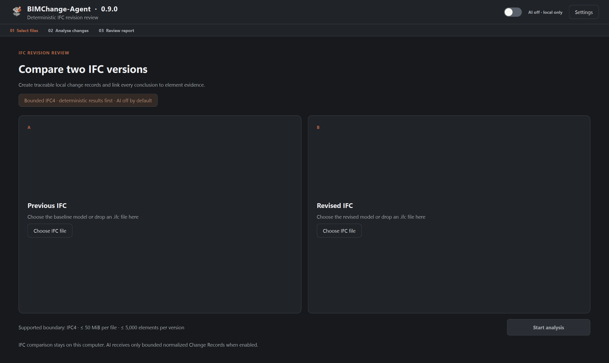
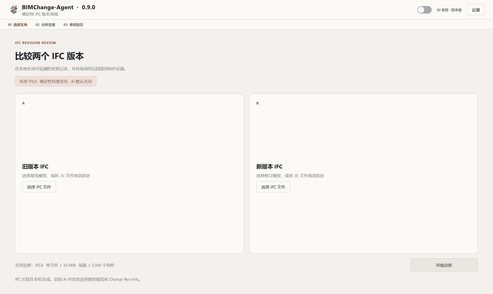
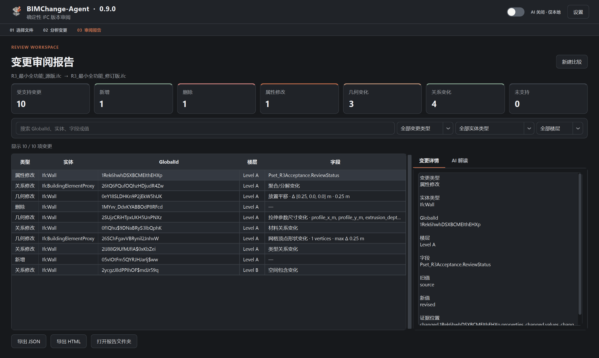
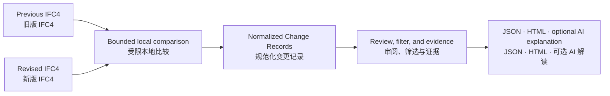
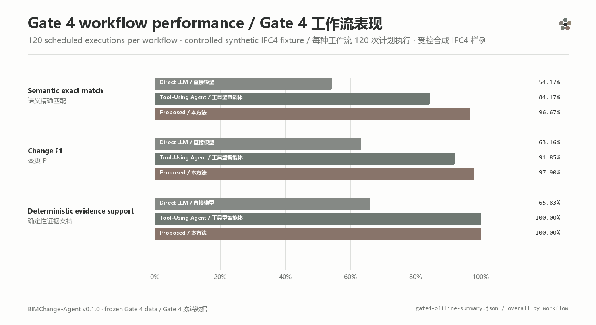
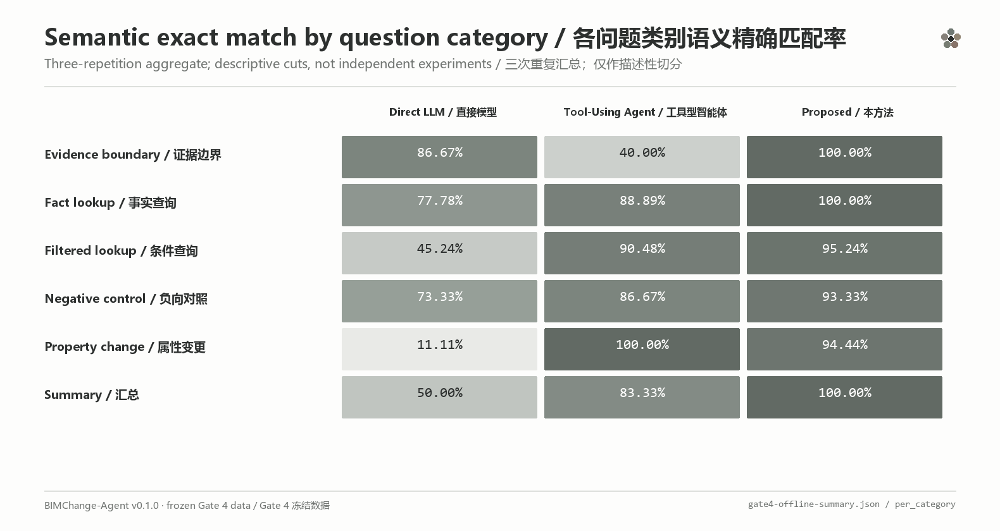
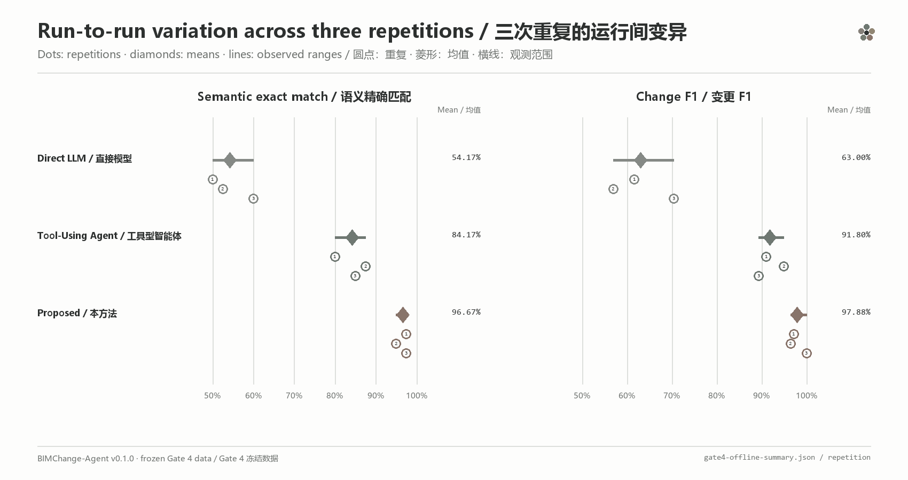
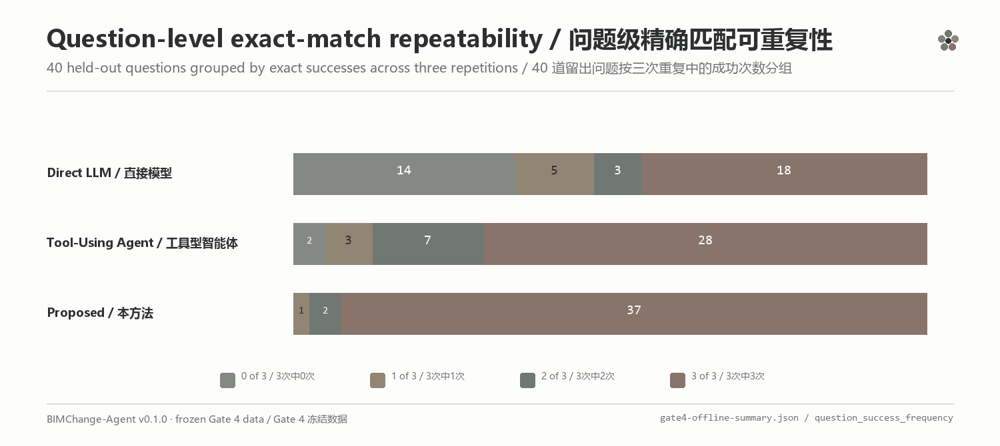
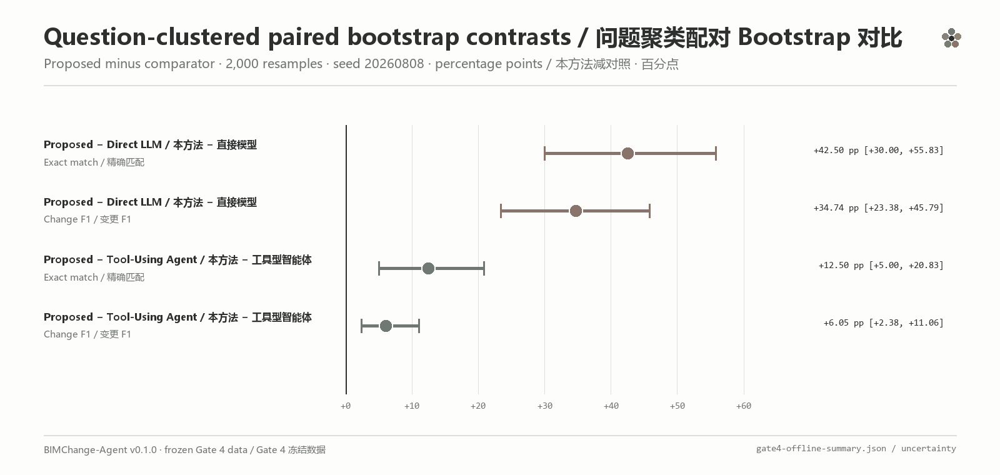
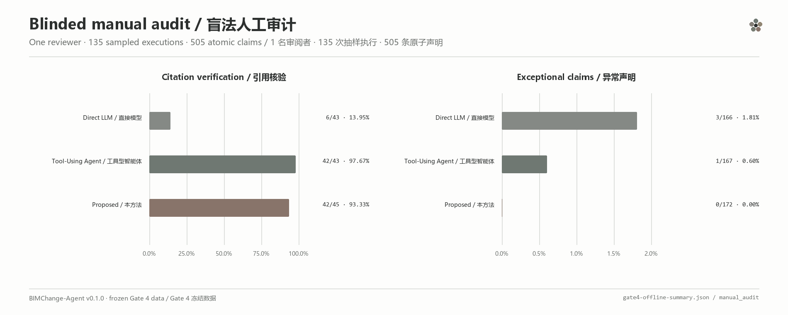

# BIMChange-Agent

<p align="center">
    
</p>

**Auditable IFC revision review built from structured evidence.**

**以结构化证据为基础、可审计的 IFC 版本变更审阅工具。**

BIMChange-Agent is an offline-first Windows application for comparing two bounded IFC4 revisions. Its deterministic v0.9.0 workflow produces normalized Change Records for additions, deletions, property values, three controlled geometry subtypes, and four direct relationship families, with filtering, evidence review, and JSON or HTML export. An optional provider-based AI layer can turn those records into a concise natural-language summary and rational analysis without replacing the local result.

BIMChange-Agent 是一款离线优先的 Windows 应用，用于比较两个处于明确支持边界内的 IFC4 版本。v0.9.0 的确定性流程会为新增、删除、属性值、3 种受控几何子类型与 4 类直接关系生成规范化 Change Records，并支持筛选、证据审阅及 JSON 或 HTML 导出。可选 AI 层可将这些记录转换为简洁的自然语言摘要与理性分析，但不会替代本地结果。

[](https://github.com/delongwangshu49-hub/bimchange-agent/releases/tag/v0.9.0)
[](https://github.com/delongwangshu49-hub/bimchange-agent/releases/tag/v0.1.0)


> [!IMPORTANT]
> v0.9.0 is a stable release with a deliberately bounded IFC4 contract, not a claim of general IFC or general geometry-change compatibility, and not professional engineering validation. The deterministic report remains the source of fact; AI output is optional explanatory text and may contain errors.
>
> v0.9.0 是采用主动收窄 IFC4 契约的稳定版本，不宣称通用 IFC 或通用几何变化兼容性，也不构成专业工程验证。确定性报告始终是事实来源；AI 输出仅为可选解释文本，可能存在错误。

## Download and install / 下载与安装

Download `BIMChange-Agent-0.9.0-win-x64-setup.exe` and its SHA-256 sidecar from the [v0.9.0 release](https://github.com/delongwangshu49-hub/bimchange-agent/releases/tag/v0.9.0). The installer targets the current Windows user and does not require Python or administrator access.

从 [v0.9.0 发布页面](https://github.com/delongwangshu49-hub/bimchange-agent/releases/tag/v0.9.0)下载 `BIMChange-Agent-0.9.0-win-x64-setup.exe` 及其 SHA-256 校验文件。安装器默认面向当前 Windows 用户，无需 Python 或管理员权限。

1. Verify the downloaded installer. / 核对下载文件的 SHA-256：

   ```powershell
   Get-FileHash .\BIMChange-Agent-0.9.0-win-x64-setup.exe -Algorithm SHA256
   ```

2. Run the installer. Windows SmartScreen may show an unknown-publisher warning because this build is not code-signed. / 运行安装程序；由于当前构建未进行代码签名，Windows SmartScreen 可能显示未知发布者。
3. Launch BIMChange-Agent from the desktop or Start Menu. / 从桌面或开始菜单启动 BIMChange-Agent。
4. Select or drag the previous IFC on the left and the revised IFC on the right. / 在左侧选择旧版 IFC，在右侧选择新版 IFC。
5. Keep AI off for a fully local deterministic comparison, then select **Start analysis**. / 保持 AI 关闭即可执行完全本地的确定性比较，然后选择“开始分析”。
6. Filter and inspect the report, then export JSON or self-contained HTML when needed. / 筛选并查看报告，按需导出 JSON 或独立 HTML。

## Product view / 产品界面

v0.9.0 brings additions, deletions, property modifications, three controlled geometry subtypes, and four direct relationship families into one review workspace. The views below show the bilingual workflow from file selection to evidence-linked report review. They were captured from the stable build using only the program-generated synthetic acceptance pair and contain no real project files, local paths, API keys, account details, or personal identifiers.

v0.9.0 将新增、删除、属性修改、3 种受控几何子类型与 4 类直接关系统一呈现在同一审阅工作区。以下视图展示从文件选择到证据关联报告审阅的双语流程；截图来自稳定构建且仅使用程序生成的合成验收对，不包含真实项目文件、本地路径、API Key、账户信息或个人身份信息。







## Product workflow / 产品流程



The deterministic path stays local and is authoritative. AI is off by default and is only an optional explanation layer.

确定性路径在本地运行并作为权威结果；AI 默认关闭，只是可选解释层。

## What v0.9.0 includes / v0.9.0 功能

- Deterministic comparison of bounded IFC4 revision pairs. / 对明确边界内的 IFC4 版本对执行确定性比较。
- Normalized additions, deletions, property-value modifications, three controlled geometry subtypes, and four direct relationship families. / 规范化新增、删除、属性值修改、3 种受控几何子类型及 4 类直接关系变化。
- Translation details include project-world old/new origins, the X/Y/Z displacement vector, distance in metres, and a deterministic evidence selector. / 平移详情包含项目世界坐标中的新旧原点、X/Y/Z 位移向量、米制距离及确定性证据位置。
- Rectangular-extrusion changes reconstruct `XDim`, `YDim`, and `Depth` independently in metres; topology-preserving tessellated changes report changed vertices and maximum displacement. / 矩形拉伸变化分别以米重建 `XDim`、`YDim` 与 `Depth`；拓扑不变网格变化报告顶点变化数与最大位移。
- Direct spatial containment, aggregation/decomposition, type-assignment, and material-association changes retain old and new references. / 直接空间包含、聚合/分解、类型指派与材料关联变化保留新旧关系引用。
- Search and filters by change type, entity type, and storey. / 按变化类型、实体类型和楼层搜索筛选。
- Evidence-linked detail pane plus JSON and self-contained HTML export. / 证据关联详情面板，以及 JSON 和独立 HTML 导出。
- Optional DeepSeek, OpenAI, Anthropic, or Google Gemini explanation adapters. / 可选 DeepSeek、OpenAI、Anthropic 或 Google Gemini 解读适配器。
- Natural-language AI summary, short rational analysis, limitations, and persistent disclaimer. / AI 自然语言摘要、简短理性分析、局限性说明与持续免责声明。
- Chinese UI produces Chinese AI output; English UI produces English AI output. / 中文界面请求中文 AI 输出，英文界面请求英文 AI 输出。
- Simplified Chinese and English interfaces with system, light, and dark themes. / 简体中文与英文界面，以及跟随系统、浅色和深色主题。

## Supported boundary / 支持边界

| Item / 项目 | v0.9.0 boundary / v0.9.0 边界 |
|---|---|
| Schema / 模式 | exact `IFC4` only / 仅精确 `IFC4` |
| File size / 文件大小 | no more than 50 MiB per file / 单文件不超过 50 MiB |
| Elements / 构件数量 | no more than 5,000 `IfcElement` objects per revision / 每版不超过 5,000 个 `IfcElement` |
| Revision continuity / 版本连续性 | at least 50% shared element GlobalIds on the smaller side / 较小一侧至少 50% 的构件 GlobalId 重合 |
| Normalized changes / 规范化变化 | addition, deletion, property-value modification; placement translation; rectangular-extrusion dimensions; topology-preserving tessellated vertices; four direct relationship families / 新增、删除、属性值修改；放置平移；矩形拉伸尺寸；拓扑不变网格顶点；四类直接关系 |
| Geometry contract / 几何契约 | one Body `IfcExtrudedAreaSolid` + `IfcRectangleProfileDef`, or one Body `IfcTriangulatedFaceSet`; identity, placement/rotation where required, profile kind, direction, openings/projections, and topology must satisfy subtype invariants / 单一 Body 指定表示链，并保持各子类型要求的身份、放置/旋转、轮廓种类、方向、洞口/投影与拓扑不变量 |
| Exclusions / 排除项 | rotation, other profiles/solids, extrusion-direction or topology changes, openings/projections, nested materials, mixed semantics, ambiguous reconstruction, and below-threshold movement / 旋转、其他轮廓/实体、拉伸方向或拓扑变化、洞口/投影、嵌套材料、混合语义、重建歧义及低于阈值的位移 |

IFC2X3 and arbitrary real-project IFC pairs remain outside the product support claim.

IFC2X3 与任意真实项目 IFC 文件对仍不在当前产品支持声明内。

## AI and privacy / AI 与隐私

AI is disabled by default. The local comparison and deterministic report do not require a provider. When AI is explicitly enabled, the application sends at most 200 normalized Change Records plus aggregate counts to the selected provider. It does not send IFC binaries, absolute local paths, file names, or the API key itself. Normalized records may still contain project-derived values such as entity identifiers, storey names, property names, before/after values, and—for supported translations—project-world origins and displacement vectors. Review provider terms and data sensitivity before enabling AI.

AI 默认关闭，本地比较与确定性报告不依赖任何服务商。只有用户明确启用 AI 时，应用才会向所选服务商发送不超过 200 条规范化 Change Records 及汇总数量；不会发送 IFC 二进制文件、绝对本地路径、文件名或 API Key 本身。规范化记录仍可能包含来自项目的实体标识、楼层名称、属性名称、修改前后值，以及受支持平移的项目世界坐标原点与位移向量，因此启用前应审查服务商条款与数据敏感性。

API keys stay in process memory for the current session and are not written to preferences or exported reports. AI failures never invalidate the completed local report. Provider compatibility is covered by offline request/response fixtures and does not imply live-account validation for every model or account configuration.

API Key 仅保留在当前进程内存中，不会写入偏好设置或导出报告。AI 失败不会使已经完成的本地报告失效。服务商兼容性由离线请求/响应样例覆盖，不代表每个模型或账户配置都已经完成在线验证。

## Source quickstart / 源码快速开始

Validated development environment: 64-bit Python 3.13 on Windows.

已验证的开发环境为 Windows 64 位 Python 3.13。

```powershell
git clone https://github.com/delongwangshu49-hub/bimchange-agent.git
cd bimchange-agent
python -m venv .venv
.\.venv\Scripts\python.exe -m pip install -r requirements.txt
.\.venv\Scripts\python.exe scripts\check_ifc.py
.\.venv\Scripts\python.exe scripts\query_change_records.py examples\query-added-beams.json
.\.venv\Scripts\python.exe scripts\test_quickstart.py
```

Custom paths, expected outputs, controlled fixture generation, and safe dry-run behaviour are documented in the [bilingual quickstart](docs/quickstart.md).

自定义路径、预期输出、受控样例生成和安全 dry-run 行为详见[双语快速开始](docs/quickstart.md)。

## Verification and evidence / 验证与证据

The v0.9.0 evidence is deliberately reported as bounded measurements rather than a universal compatibility claim:

| Evidence slice / 证据切片 | Measured result / 实测结果 |
|---|---|
| Stable offline regression / 稳定版离线回归 | 46 product, desktop, reporting, provider, and failure-closed tests + 9 complete-R3 research tests / 46 项产品、桌面、报告、服务商与失败关闭测试 + 9 项完整 R3 研究测试 |
| One-pass synthetic acceptance / 单次合成验收 | 10 supported: 1 added, 1 deleted, 1 property, 3 geometry, 4 relationship; 0 unsupported / 10 条受支持：新增 1、删除 1、属性 1、几何 3、关系 4；未支持 0 |
| Repeatability / 重复性 | two clean builds with identical normalized semantics / 两次干净构建规范化语义一致 |
| Traceability / 可追溯性 | 100% unique reconstruction resolution / 唯一重建解析率 100% |
| Integrity / 完整性 | 16/16 fixed tamper cases rejected; 0 false acceptance / 固定 16 项篡改全部拒绝；误接受 0 |
| Data boundary / 数据边界 | 0 privacy violations and 0 model/API calls in the R3 gate / R3 闸门中隐私违规 0、模型/API 调用 0 |
| Frozen Gate 4 study / 冻结 Gate 4 研究 | 360 primary executions; proposed workflow 98.33% completion, 96.67% semantic exact match, 97.90% Change F1, 100% deterministic evidence support / 360 次主执行；所提工作流完成率 98.33%、语义精确匹配 96.67%、Change F1 97.90%、确定性证据支持率 100% |

The packaged application is also required to pass startup checks and the installer an isolated install, launch, and uninstall smoke test. The R3 numbers come from repository-generated synthetic IFC4, while Gate 4 used one independently constructed synthetic held-out fixture across 40 questions × 3 workflows × 3 repetitions. Neither establishes arbitrary exporter, real-project, Windows-machine, live-provider, or professional engineering validity.

打包应用还必须通过启动检查，安装器必须通过隔离安装、启动与卸载烟雾测试。R3 数字来自仓库程序生成的合成 IFC4；Gate 4 使用一个独立构造的合成留出 fixture，覆盖 40 个问题 × 3 种工作流 × 3 次重复。两者均不证明任意导出器、真实项目、Windows 机器、在线服务商或专业工程有效性。

The frozen Gate 4 artifacts remain under [`evals/results/held_out`](evals/results/held_out), with the broader evidence track under [`research`](research). Historical research artifacts do not expand the v0.9.0 product boundary.

冻结的 Gate 4 产物位于 [`evals/results/held_out`](evals/results/held_out)，其余证据工作位于 [`research`](research)。历史研究产物不会扩大 v0.9.0 的产品支持边界。

See the [Chinese changelog](CHANGELOG.zh-CN.md), [bilingual v0.9.0 release record](docs/releases/v0.9.0.md), [complete R3 boundary](docs/r3-complete.md), [privacy and security boundary](docs/privacy-and-security.md), and [Windows installer notes](docs/windows-installer.md).

版本变化与使用边界详见[中文更新日志](CHANGELOG.zh-CN.md)、[双语 v0.9.0 发布记录](docs/releases/v0.9.0.md)、[完整 R3 边界](docs/r3-complete.md)、[隐私与安全边界](docs/privacy-and-security.md)及 [Windows 安装包说明](docs/windows-installer.md)。

## Experimental lineage / 实验沿革

Before the Windows product workflow was assembled, the project progressed through a bounded sequence of reproducible experiments:

1. **Deterministic foundation.** Synthetic IFC4 revisions were generated and checked with deterministic validators so every expected change had a known evidence trail.
2. **Development comparison.** A minimal agent workflow was compared with direct-model and tool-using baselines, while per-question checkpoints and structured outputs were tested offline.
3. **Frozen held-out evaluation.** Prompts, questions, schedules, scoring rules, budgets, and protected baselines were frozen before execution. Three workflows each ran 120 scheduled executions across 40 held-out questions and three repetitions.
4. **Post-run audit.** Exact match, Change F1, evidence support, repeatability, paired bootstrap contrasts, and a blinded manual audit were reported from frozen artifacts.

在 Windows 产品工作流成形之前，项目依次完成了确定性合成样例与验证、最小智能体及基线对比、调用前冻结的独立留出评测，以及运行后的重复性、不确定性与盲法人工审计。以下图表属于早期实验记录，用于说明方法演进与证据链；它们不扩大 v0.9.0 的产品支持边界，也不表示 IFC2X3 已获产品支持。

<table>
  <tr>
    <td width="50%"></td>
    <td width="50%"></td>
  </tr>
  <tr>
    <td align="center"><sub>Overall workflow comparison / 工作流总体对比</sub></td>
    <td align="center"><sub>Category-level exact match / 分类精确匹配</sub></td>
  </tr>
  <tr>
    <td width="50%"></td>
    <td width="50%"></td>
  </tr>
  <tr>
    <td align="center"><sub>Run-to-run stability / 三次重复稳定性</sub></td>
    <td align="center"><sub>Question-level repeatability / 问题级可重复性</sub></td>
  </tr>
  <tr>
    <td width="50%"></td>
    <td width="50%"></td>
  </tr>
  <tr>
    <td align="center"><sub>Paired bootstrap contrasts / 配对 Bootstrap 对比</sub></td>
    <td align="center"><sub>Blinded manual audit / 盲法人工审计</sub></td>
  </tr>
</table>

Detailed frozen evidence remains available in [Gate 3 development results](docs/gate3-development-results.md), [Gate 4 held-out results](docs/gate4-held-out-results.md), and the [Gate 4 result artifacts](evals/results/held_out/gate4-controlled-heldout-v0.1.0/).

## Possible directions / 可能方向

BIMChange-Agent is expected to continue through evidence-gated increments rather than a fixed feature calendar. The directions below are working possibilities, not delivery commitments; their order, scope, or inclusion may change with reproducible findings, maintenance cost, and user feedback.

BIMChange-Agent 后续更可能按“证据通过后再增量推进”的方式演进，而不是绑定固定功能日历。以下内容是当前可能方向，不构成交付承诺；其顺序、范围或是否进入产品，均可能随可复现结果、维护成本和用户反馈调整。

| Direction / 方向 | What may be explored / 可能探索 | Decision gate / 决策条件 |
|---|---|---|
| **Product reliability and review experience** / 产品可靠性与审阅体验 | Clearer diagnostics, error recovery, accessibility, long-field and high-DPI behaviour, packaging, and a more coherent review flow. / 更清晰的诊断与错误恢复、可访问性、长字段与高 DPI 表现、安装交付及更连贯的审阅流程。 | Reproducible issues, bounded Windows regression checks, and maintainable packaging. / 具备可复现问题、有界 Windows 回归与可维护的交付方案。 |
| **Evidence navigation and audit trails** / 证据导航与审计链 | Tighter links from a report row and GlobalId to deterministic evidence, trace manifests, and review-friendly exports. / 加强报告记录及 GlobalId 与确定性证据、追溯清单和便于审阅的导出之间的联系。 | Unique evidence resolution, repeatable generation, and failure-closed tamper checks. / 证据可唯一解析、可重复生成，并能对受控篡改失败关闭。 |
| **Optional AI explanation** / 可选 AI 解读 | Provider-specific adapters, clearer uncertainty, citation discipline, and tests of factual faithfulness to existing Change Records. / 按服务商完善适配、加强不确定性表达与引用纪律，并检验解读对既有 Change Records 的事实忠实度。 | Explicit activation, provider-specific protocol tests, privacy disclosure, and evidence-based evaluation. / 明确启用、逐服务商协议测试、隐私披露与基于证据的评估。 |
| **Local spatial context** / 局部空间上下文 | A bounded view of changed elements, nearby context, or storeys, with report-to-GlobalId highlighting. / 对变化构件、局部邻域或楼层进行有界展示，并支持从报告定位到相同 GlobalId。 | A lightweight conversion/viewing path that preserves performance and privacy; this would not imply a full BIM viewer or general geometry-diff support. / 需先验证轻量转换与查看路径、性能和隐私；这不等同于完整 BIM 查看器或通用几何差分支持。 |
| **External-validity and schema exploration** / 外部有效性与模式探索 | Additional independent, authorised samples or exporters may be used to test repeatability. IFC2X3 may continue as a bounded experimental track. / 可能使用更多独立、获授权的样本或导出来源检验重复性；IFC2X3 可继续作为有界实验方向。 | Pre-registration, independent traceability, failure-closed validation, product regression, and a separate support decision. / 需要预注册、独立追溯、失败关闭验证、产品回归与单独支持决策。 |

A direction would enter the supported product boundary only after its evidence, privacy, regression, and release conditions are separately satisfied. Until then, the current v0.9.0 boundary remains authoritative.

任何方向只有在证据、隐私、回归与发布条件分别满足后，才可能进入产品支持边界。在此之前，当前 v0.9.0 边界仍为权威声明。

## Feedback / 反馈

Please [open an issue](https://github.com/delongwangshu49-hub/bimchange-agent/issues/new/choose) with the application version, Windows version, IFC schema, approximate file sizes, and reproducible steps. Never upload confidential IFC files, API keys, or unredacted reports to a public issue.

欢迎[提交 Issue](https://github.com/delongwangshu49-hub/bimchange-agent/issues/new/choose)，并说明应用版本、Windows 版本、IFC Schema、文件大致规模和复现步骤。请勿向公开 Issue 上传保密 IFC、API Key 或未经脱敏的报告。
