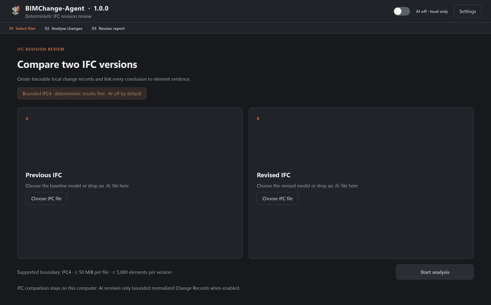
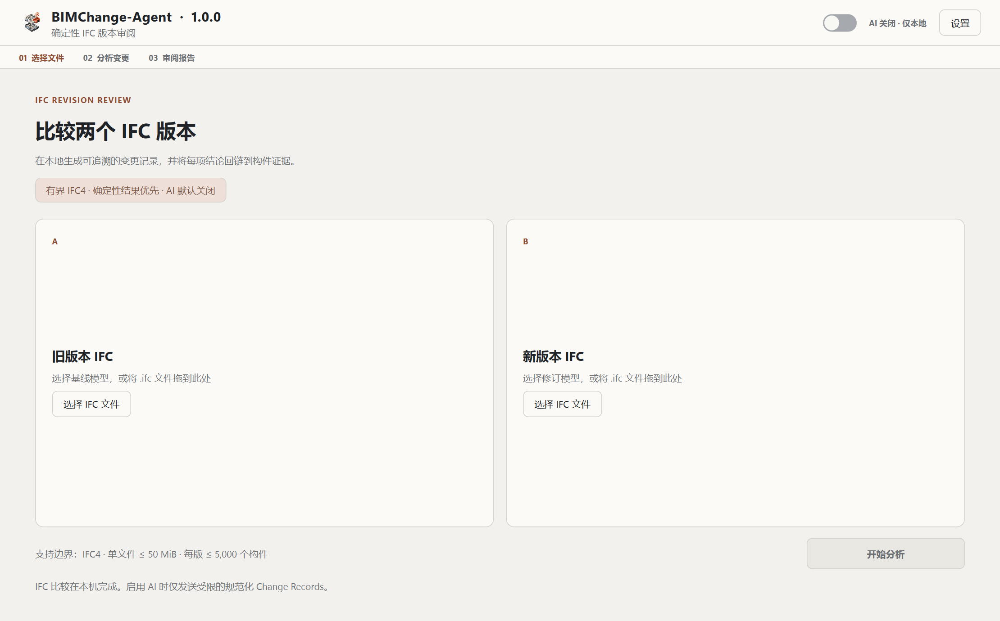
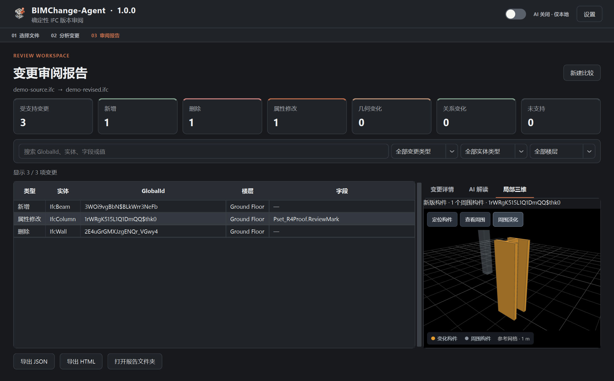
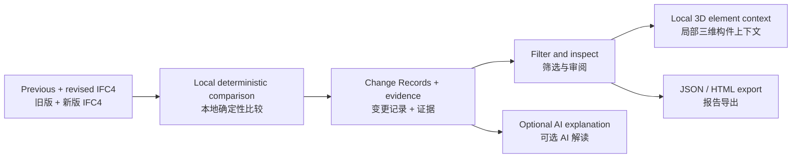

# BIMChange-Agent

<p align="center">
    
</p>

**Understand what changed. See the element. Follow the evidence.**

**读懂版本变化，定位具体构件，追溯确定性证据。**

BIMChange-Agent **1.0.0** is an offline-first Windows IFC4 revision-review application. Compare two revisions, filter normalized Change Records, inspect before/after evidence, and locate the changed element in a local 3D view. Optional AI explains the records; it does not decide what changed.

BIMChange-Agent **1.0.0 正式版**是一款离线优先的 Windows IFC4 版本审阅工具。比较新旧版本、筛选规范化变更记录、查看修改前后证据，并在局部三维中定位变化构件。可选 AI 负责解读记录，不负责判定变化。


[](https://github.com/delongwangshu49-hub/bimchange-agent/releases/tag/v0.1.0)

[Features / 功能](#features--功能) · [3D review / 三维审阅](#local-3d-review--局部三维审阅) · [Install / 安装](#download-and-install--下载与安装) · [Research / 研究](#experimental-lineage--实验沿革) · [Related project / 相关项目](#related-project--相关项目)

> [!IMPORTANT]
> **Binary release preparation:** the maintainer has authorized this 1.0.0 source/documentation update, but 1.0.0 binaries are not yet published. Binary redistribution remains gated by the [release checklist](docs/releases/v1.0.0-release-checklist.md). [v0.9.0](https://github.com/delongwangshu49-hub/bimchange-agent/releases/tag/v0.9.0) remains the previously published stable release.
>
> **二进制发布准备状态：**作者已授权本次 1.0.0 源码与文档更新，但 1.0.0 二进制尚未发布，仍须完成[发布检查清单](docs/releases/v1.0.0-release-checklist.md)。此前已发布的稳定版本仍为 [v0.9.0](https://github.com/delongwangshu49-hub/bimchange-agent/releases/tag/v0.9.0)。

## Product view / 产品界面

The 1.0.0 screenshots below are captured from the application using program-generated synthetic data only. The highlighted I-section is actual IFC geometry, not a bounding-box marker. No private building models or their derivatives are used.

以下 1.0.0 截图来自实际程序，仅使用程序生成的合成数据。高亮工字形构件来自 IFC 实际几何，不是包围盒标记；不使用私人建筑模型或其派生内容。







<details>
<summary>Preserved v0.9.0 product gallery / 保留的 v0.9.0 产品图集</summary>

These historical synthetic screenshots document the earlier workflow; they are not 1.0.0 screenshots.

以下历史合成截图记录旧版工作流，不冒充 1.0.0 界面。


</details>

## Features / 功能

| Capability / 能力 | What you can review / 可以审阅什么 |
|---|---|
| Revision comparison / 版本比较 | Additions, deletions and property-value modifications, with element identity and old/new values. / 新增、删除与属性值修改，保留构件身份和修改前后值。 |
| Controlled geometry changes / 受控几何变化 | Placement translation; rectangular-extrusion dimensions; topology-preserving tessellated vertices. Translation includes world-space origins, XYZ displacement and metres; shape details include changed vertices and maximum displacement. / 放置平移、矩形拉伸尺寸、拓扑不变网格顶点。平移提供世界坐标原点、XYZ 位移和米制距离；形状详情提供变化顶点数与最大位移。 |
| Direct relationships / 直接关系 | Spatial containment, aggregation/decomposition, type assignment and material association, retaining old/new references. / 空间包含、聚合/分解、类型指派与材料关联，保留新旧引用。 |
| Evidence workspace / 证据工作区 | Search and filter by change type, entity type and storey; inspect normalized values and evidence selectors. / 按变化类型、实体类型、楼层搜索筛选，查看规范化值与证据位置。 |
| Local 3D / 局部三维 | Select a record to color its IFC mesh, inspect contours and nearby context, with a black background and reference grid. / 选择记录直接给 IFC 构件网格着色，查看轮廓和邻近环境，使用黑底与参考网格。 |
| Shareable reports / 可分享报告 | JSON and self-contained bilingual HTML. Exported HTML is a report, not an embedded interactive 3D scene. / JSON 与中英双语独立 HTML；导出 HTML 是报告，不包含交互式三维场景。 |
| Optional explanation / 可选解读 | DeepSeek, OpenAI, Anthropic and Google Gemini adapters; summary, rational analysis, limitations and disclaimer. / 四类服务商适配器，提供摘要、理性分析、局限与免责声明。 |
| Everyday usability / 日常使用 | Chinese/English, system/light/dark themes, background geometry conversion, bounded caches and on-demand rendering. / 中英界面、系统/浅色/深色主题、后台几何转换、有界缓存与按需渲染。 |



## Local 3D review / 局部三维审阅

1. Select a report row and open **Spatial context**. / 选择报告记录并打开“局部三维”页签。
2. The target uses its own triangulated IFC shape and change color; nearby elements are subdued. Deleted targets come from the previous revision, other targets from the revised revision. / 目标使用自身 IFC 三角网格并按变化类型着色，周围构件淡化。删除目标取旧版，其他目标取新版。
3. Rotate, pan and zoom; use **Focus element**, **Fit context** and the context-fade control. / 旋转、平移、缩放，使用“定位构件”“查看周围”和“周围淡化”。
4. The black background and XY grid provide orientation and scale. The grid is a visual reference, **not surveyed building axes or an actual floor**. / 黑底与 XY 网格辅助建立方向和尺度感；网格只是视觉参考，**不是测量轴网或实际楼板**。

The view is deliberately local: one target plus at most two unchanged neighbors in the same direct storey within 6 m. Missing/ambiguous geometry or storey context produces an unavailable state instead of a fabricated box. Rapid row changes discard stale results; unchanged scenes reuse caches, and idle scenes stop continuous redraw. Initial WebEngine startup can still briefly pause the UI.

视图主动限制为一个目标，加同一直接楼层、6 米邻域内最多两个未变化构件。几何或楼层上下文缺失、歧义时会提示不可用，不伪造方盒子。快速切换记录时旧请求不会覆盖新选择；重复场景复用缓存，静止场景停止持续重绘。WebEngine 首次启动仍可能短暂停顿。

**Rendering a shape does not imply that every possible edit to that shape can be classified.** The viewer adds context without changing the deterministic comparison contract. It is not a full-model viewer, clash detector, Revit integration or engineering validation tool.

**能显示某个形状，不代表能分类该形状的任意变化。**三维仅增加审阅上下文，不改变确定性比较契约；它不是完整模型查看器、碰撞检测器、Revit 集成或工程验证工具。

## Download and install / 下载与安装

For now, use the previously published [v0.9.0 release](https://github.com/delongwangshu49-hub/bimchange-agent/releases/tag/v0.9.0), which does not include the new local 3D view. The planned 1.0.0 assets are listed below; **do not rename an older/private build to these names**.

当前可下载此前发布的 [v0.9.0](https://github.com/delongwangshu49-hub/bimchange-agent/releases/tag/v0.9.0)，该版本不含新增局部三维。以下是 1.0.0 计划使用的发布文件名，**不得把旧版或私有构建直接改名冒充**。

- `BIMChange-Agent-1.0.0-win-x64-setup.exe` + SHA-256 sidecar / 安装器及校验文件。
- `BIMChange-Agent-1.0.0-win-x64.zip` + SHA-256 sidecar / 便携包及校验文件。
- Matching third-party notices and corresponding-source materials / 匹配的第三方声明与对应源码材料。

After publication: verify the SHA-256, run the per-user installer, and launch from the Start Menu. No Python is needed for packaged builds. Unsigned builds may trigger SmartScreen; a checksum verifies file identity, not publisher trust.

发布后：核对 SHA-256，运行当前用户安装器，从开始菜单启动。打包版无需 Python。未签名构建可能触发 SmartScreen；校验和确认文件一致性，不等于发布者身份认证。

Select the previous and revised IFC files, keep AI off for local-only review, and start analysis. Filter the results, inspect evidence and 3D, then export when needed.

选择旧版与新版 IFC，保持 AI 关闭以执行完全本地的审阅，再开始分析。筛选结果、查看证据与三维，按需导出。

## Supported boundary / 支持边界

| Item / 项目 | 1.0.0 boundary / 1.0.0 边界 |
|---|---|
| Schema / 模式 | Exact `IFC4` only / 仅精确 `IFC4` |
| Size / 规模 | ≤ 50 MiB per file; ≤ 5,000 `IfcElement` objects per revision / 每文件 ≤ 50 MiB；每版 ≤ 5,000 个构件 |
| Continuity / 连续性 | ≥ 50% shared element GlobalIds on the smaller side / 较小一侧构件 GlobalId 重合率 ≥ 50% |
| Translation / 平移 | Same identity, local shape and rotation; independently reconstructed displacement meets the threshold / 身份、局部形状和旋转不变，独立重建位移达到阈值 |
| Extrusion dimensions / 拉伸尺寸 | Single Body `IfcExtrudedAreaSolid` + `IfcRectangleProfileDef`; independently reconstruct XDim, YDim and Depth under fixed subtype invariants / 单一指定表示链，在子类型不变量下独立重建三项尺寸 |
| Tessellated shape / 网格形状 | Single Body `IfcTriangulatedFaceSet`, unchanged topology, identity and placement / 单一三角网格表示，拓扑、身份与放置不变 |
| Relationships / 关系 | Four direct families only; no arbitrary nested material or relationship inference / 仅四类直接关系，不推断任意嵌套材料或关系 |
| Artifact / 产物 | Existing schema `0.4.0` retained / 延续既有 `0.4.0` Schema |

Rotation, general profile/solid edits, changed extrusion direction, topology changes, unsupported opening/projection edits, mixed semantics and ambiguous reconstruction are outside supported geometry classification. Unsupported evidence is retained where available; **no supported geometry record does not mean no geometry changed**. IFC2X3, arbitrary exporters and arbitrary real-project pairs remain outside the product support claim. See the [complete R3 contract](docs/r3-complete.md) and [3D boundary](docs/local-3d-review.md).

旋转、一般轮廓/实体修改、拉伸方向改变、拓扑变化、不支持的洞口/投影修改、混合语义及歧义重建均不属于受支持几何分类。可获得的未支持证据会被保留；**没有受支持几何记录，不等于没有几何变化**。IFC2X3、任意导出器与任意真实项目文件对仍不在产品支持声明内。详见[完整 R3 契约](docs/r3-complete.md)及[三维边界](docs/local-3d-review.md)。

## AI and privacy / AI 与隐私

AI is off by default. IFC parsing, comparison and 3D conversion stay on the computer. The viewer uses a session-restricted loopback server, local assets and temporary meshes; it does not upload IFC or GLB data.

AI 默认关闭。IFC 解析、比较和三维转换留在本机；查看器使用会话受限的本机回环服务、本地资源与临时网格，不上传 IFC 或 GLB。

When explicitly enabled, AI receives at most 200 normalized Change Records plus aggregate counts, without IFC binaries, absolute paths or source/revised file names. Records can still disclose GlobalIds, storeys, property values and geometry coordinates. The API key is sent to the selected provider for authentication, **not placed in the model prompt, preferences or exported reports**; the application keeps it only in session memory.

明确启用后，AI 接收最多 200 条规范化变更及汇总数量，不包含 IFC 二进制、绝对路径或新旧文件名；记录仍可能披露 GlobalId、楼层、属性值和几何坐标。API Key 会发送给所选服务商用于身份认证，**不放入模型提示、偏好设置或导出报告**，应用仅在会话内存中保留密钥。

AI cannot replace the local report and may be wrong. Provider failure leaves the deterministic report available. Adapter tests use offline fixtures, not a guarantee for every live model/account. Review project permissions and provider terms before enabling AI. [Privacy and security / 隐私与安全](docs/privacy-and-security.md).

AI 不会替代本地报告，也可能出错；服务商失败时确定性报告仍可用。适配器测试使用离线样例，不保证每个在线模型/账户均可用。启用前请检查项目权限和服务商条款。

## Source quickstart / 源码快速开始

Validated environment: Windows x64, Python 3.13, PowerShell 7. These commands target the 1.0.0 source after it is published; the remote repository may still contain the older version during preparation.

验证环境：Windows x64、Python 3.13、PowerShell 7。下列命令针对发布后的 1.0.0 源码；准备期间远端可能仍为旧版。

```powershell
git clone https://github.com/delongwangshu49-hub/bimchange-agent.git
cd bimchange-agent
python -m venv .venv
.\.venv\Scripts\python.exe -m pip install -c constraints-preview.txt -e ".[desktop]"
.\.venv\Scripts\bimchange-desktop.exe
```

Generate a public synthetic pair without reading any user model / 不读取用户模型即可生成公开合成示例：

```powershell
.\.venv\Scripts\python.exe scripts\generate_public_demo.py artifacts\public-demo
```

Choose `demo-source.ifc` and `demo-revised.ifc` from that new directory. Expected: one addition, one deletion and one property modification. The I-section illustrates actual-mesh highlighting; this illustrative pair is not a new research benchmark.

在新目录中选择上述两个文件，预期新增、删除、属性修改各一条。工字形构件用于展示原形着色；该演示不作为新的研究基准。

For CLI queries and controlled fixtures, see the [bilingual quickstart](docs/quickstart.md). For builds, see [Windows packaging](docs/windows-installer.md).

命令行查询与受控样例见[双语快速开始](docs/quickstart.md)，打包见 [Windows 说明](docs/windows-installer.md)。

## Verification and evidence / 验证与证据

Current release-preparation checks are tracked separately in the [1.0.0 checklist](docs/releases/v1.0.0-release-checklist.md). Historical results below are retained, not relabeled as fresh 1.0.0 evidence.

本次发布准备检查单独记录在 [1.0.0 清单](docs/releases/v1.0.0-release-checklist.md)。以下历史结果原样保留其含义，不冒充本次新测结果。

| Evidence slice / 证据切片 | Historical measured result / 历史实测结果 |
|---|---|
| v0.9.0 regression / 回归 | 46 product/desktop/report/provider tests + 9 complete-R3 research tests / 46 项产品等测试 + 9 项完整 R3 研究测试 |
| R3 synthetic acceptance / 合成验收 | 10 supported: 1 added, 1 deleted, 1 property, 3 geometry, 4 relationship; 0 unsupported / 10 条受支持：新增 1、删除 1、属性 1、几何 3、关系 4；未支持 0 |
| R3 repeatability / 重复性 | Two clean runs with identical normalized semantics / 两次干净运行规范化语义一致 |
| R3 traceability / 可追溯性 | 100% unique reconstruction resolution / 唯一重建解析率 100% |
| R3 integrity / 完整性 | 16/16 tamper cases rejected; 0 false acceptance / 16 项篡改全部拒绝，误接受 0 |
| R3 data boundary / 数据边界 | 0 privacy violations; 0 model/API calls in the gate / 闸门内隐私违规 0，模型/API 调用 0 |
| Frozen Gate 4 / 冻结研究 | 360 primary executions; proposed workflow 98.33% completion, 96.67% semantic exact match, 97.90% Change F1, 100% deterministic evidence support / 360 次主执行；所提工作流完成率 98.33%、语义精确匹配 96.67%、Change F1 97.90%、确定性证据支持率 100% |

R3 used generated synthetic IFC4. Gate 4 used one independently constructed synthetic held-out fixture across 40 questions × 3 workflows × 3 repetitions. Neither establishes arbitrary real-project, exporter, Windows-machine, live-provider or professional engineering validity. Frozen artifacts remain under [evals/results/held_out](evals/results/held_out) and are not rerun or modified for this release preparation.

R3 使用程序生成的合成 IFC4；Gate 4 使用一个独立构造的合成留出 fixture，覆盖 40 问题 × 3 工作流 × 3 重复。两者均不证明任意真实项目、导出器、Windows 机器、在线服务商或专业工程有效性。冻结产物保留于 [evals/results/held_out](evals/results/held_out)，本次发布准备不重跑、不修改。

## Experimental lineage / 实验沿革

Before the Windows product workflow was assembled, the project progressed through a bounded sequence of reproducible experiments:

1. **Deterministic foundation.** Synthetic IFC4 revisions were generated and checked with deterministic validators so every expected change had a known evidence trail.
2. **Development comparison.** A minimal agent workflow was compared with direct-model and tool-using baselines, while per-question checkpoints and structured outputs were tested offline.
3. **Frozen held-out evaluation.** Prompts, questions, schedules, scoring rules, budgets, and protected baselines were frozen before execution. Three workflows each ran 120 scheduled executions across 40 held-out questions and three repetitions.
4. **Post-run audit.** Exact match, Change F1, evidence support, repeatability, paired bootstrap contrasts, and a blinded manual audit were reported from frozen artifacts.

在 Windows 产品工作流成形之前，项目依次完成了确定性合成样例与验证、最小智能体及基线对比、调用前冻结的独立留出评测，以及运行后的重复性、不确定性与盲法人工审计。以下图表属于早期实验记录，用于说明方法演进与证据链；它们不扩大 1.0.0 的产品支持边界，也不表示 IFC2X3 已获产品支持。

<table>
  <tr>
    <td width="50%"></td>
    <td width="50%"></td>
  </tr>
  <tr>
    <td align="center"><sub>Overall workflow comparison / 工作流总体对比</sub></td>
    <td align="center"><sub>Category-level exact match / 分类精确匹配</sub></td>
  </tr>
  <tr>
    <td width="50%"></td>
    <td width="50%"></td>
  </tr>
  <tr>
    <td align="center"><sub>Run-to-run stability / 三次重复稳定性</sub></td>
    <td align="center"><sub>Question-level repeatability / 问题级可重复性</sub></td>
  </tr>
  <tr>
    <td width="50%"></td>
    <td width="50%"></td>
  </tr>
  <tr>
    <td align="center"><sub>Paired bootstrap contrasts / 配对 Bootstrap 对比</sub></td>
    <td align="center"><sub>Blinded manual audit / 盲法人工审计</sub></td>
  </tr>
</table>

Detailed frozen evidence remains available in [Gate 3 development results](docs/gate3-development-results.md), [Gate 4 held-out results](docs/gate4-held-out-results.md), and the [Gate 4 result artifacts](evals/results/held_out/gate4-controlled-heldout-v0.1.0/).


### From research to product / 从研究走向产品

The later evidence track progressed through R1 traceability, R2 external-validity investigation, R3 controlled geometry/relationships, and R4 local spatial context. Version 1.0.0 brings the bounded comparison and local 3D review together; it does not retroactively expand earlier experimental conclusions.

后续证据路线依次推进 R1 可追溯性、R2 外部有效性调查、R3 受控几何与关系、R4 局部空间上下文。1.0.0 将有界比较与局部三维审阅整合为产品，不追溯扩大早期实验结论。

See [research](research), the [v0.9.0 record](docs/releases/v0.9.0.md), [v1.0.0 notes](docs/releases/v1.0.0.md) and [Chinese changelog](CHANGELOG.zh-CN.md).

详见[研究目录](research)、[v0.9.0 记录](docs/releases/v0.9.0.md)、[v1.0.0 说明](docs/releases/v1.0.0.md)与[中文更新日志](CHANGELOG.zh-CN.md)。

## Related project / 相关项目

[**IFC ClashTrace**](https://github.com/delongwangshu49-hub/ifc-clashtrace) is another project by the same author. It focuses on browser-local clash and surface-clearance evidence between MEP and structural IFC models, with optional AI interpretation. BIMChange-Agent focuses on **revision changes**; IFC ClashTrace focuses on **cross-model spatial conflicts**. They are separate projects, not an integrated feature or shared compatibility guarantee.

[**IFC ClashTrace**](https://github.com/delongwangshu49-hub/ifc-clashtrace) 同样是本作者名下的相关项目，关注浏览器本地的机电与结构 IFC 碰撞、表面净距证据，并提供可选 AI 解读。BIMChange-Agent 关注**版本变化**，IFC ClashTrace 关注**跨模型空间冲突**。两者为独立项目，并非已集成功能，也不共享兼容性保证。

## Possible directions / 可能方向

Further work may improve diagnostics, accessibility, evidence navigation, measured performance and independently authorized validation. Broader spatial context, IFC2X3 or new geometry semantics require their own evidence, privacy, regression and support decisions. These are possibilities, not delivery commitments.

后续可能完善诊断、可访问性、证据导航、实测性能与独立授权验证。更广的空间上下文、IFC2X3 或新几何语义仍须各自通过证据、隐私、回归与支持决策；这些方向不构成交付承诺。

## Feedback and licensing / 反馈与许可

Please [open an issue](https://github.com/delongwangshu49-hub/bimchange-agent/issues/new/choose) with the application version, Windows version, schema, approximate file sizes and reproducible steps. Never upload confidential IFC, API keys or unredacted reports.

欢迎[提交 Issue](https://github.com/delongwangshu49-hub/bimchange-agent/issues/new/choose)，说明应用版本、Windows 版本、Schema、文件大致规模与复现步骤。请勿公开上传保密 IFC、API Key 或未经脱敏的报告。

Original project code is under [MIT](LICENSE). Bundled dependencies retain their own licenses; see [third-party notices](packaging/THIRD-PARTY-NOTICES.txt). A project MIT license alone is not permission to redistribute every collected binary.

项目原创代码采用 [MIT](LICENSE)，随附依赖保留各自许可证，详见[第三方声明](packaging/THIRD-PARTY-NOTICES.txt)。项目 MIT 许可本身不代表所有打包二进制都已完成分发合规。
