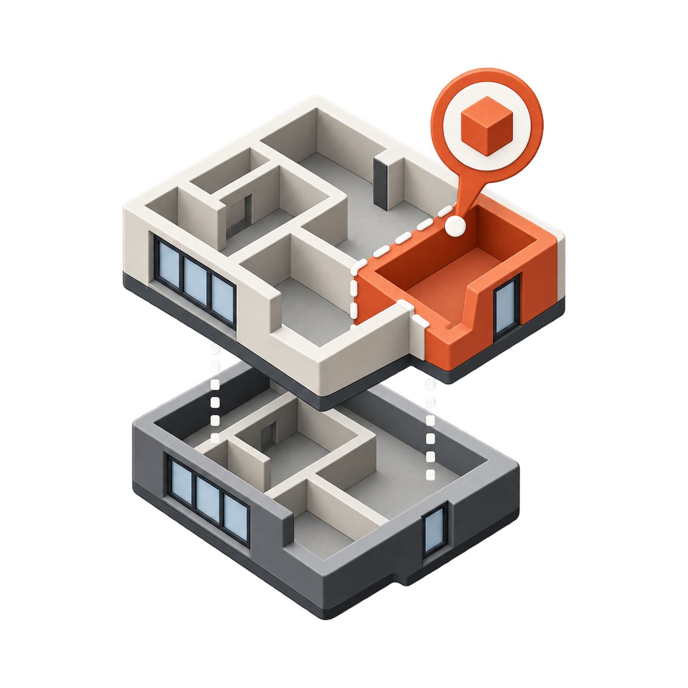
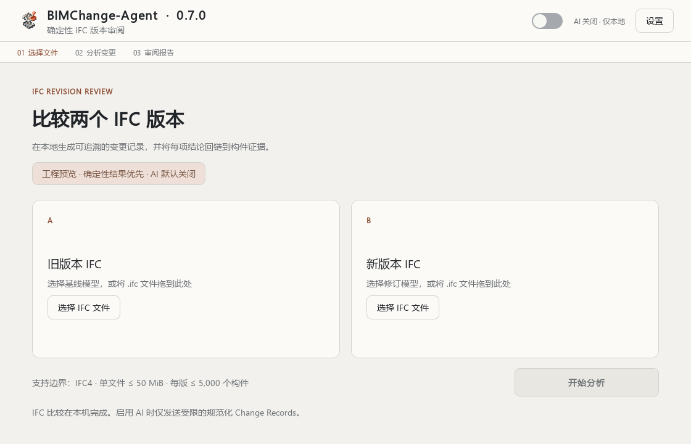
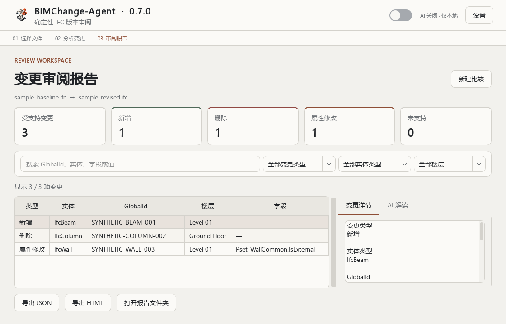
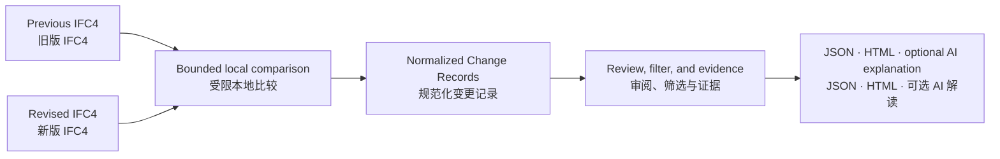

# BIMChange-Agent

<p align="center">
  
</p>

**Auditable IFC revision review built from structured evidence.**

**以结构化证据为基础、可审计的 IFC 版本变更审阅工具。**

BIMChange-Agent is an offline-first Windows application for comparing two bounded IFC4 revisions. The deterministic comparison produces normalized Change Records for filtering, evidence review, and JSON or HTML export. An optional provider-based AI layer can turn those records into a concise natural-language summary and rational analysis without replacing the local result.

BIMChange-Agent 是一款离线优先的 Windows 应用，用于比较两个处于明确支持边界内的 IFC4 版本。确定性比较会生成规范化 Change Records，可供筛选、证据审阅及 JSON 或 HTML 导出；可选 AI 层可将这些记录转换为简洁的自然语言摘要与理性分析，但不会替代本地结果。

[](https://github.com/delongwangshu49-hub/bimchange-agent/releases/tag/v0.7.0)
[](https://github.com/delongwangshu49-hub/bimchange-agent/releases/tag/v0.1.0)


> [!IMPORTANT]
> v0.7.0 is a bounded product release, not a claim of general IFC compatibility or professional engineering validation. The deterministic report remains the source of fact; AI output is optional explanatory text and may contain errors.
>
> v0.7.0 是一个边界明确的产品版本，不宣称通用 IFC 兼容性，也不构成专业工程验证。确定性报告始终是事实来源；AI 输出仅为可选解释文本，可能存在错误。

## Download and install / 下载与安装

Download `BIMChange-Agent-0.7.0-win-x64-setup.exe` and its SHA-256 sidecar from the [v0.7.0 release](https://github.com/delongwangshu49-hub/bimchange-agent/releases/tag/v0.7.0). The installer targets the current Windows user and does not require Python or administrator access.

从 [v0.7.0 Release 页面](https://github.com/delongwangshu49-hub/bimchange-agent/releases/tag/v0.7.0)下载 `BIMChange-Agent-0.7.0-win-x64-setup.exe` 及其 SHA-256 校验文件。安装器默认面向当前 Windows 用户，无需 Python 或管理员权限。

1. Verify the downloaded installer. / 核对下载文件的 SHA-256：

   ```powershell
   Get-FileHash .\BIMChange-Agent-0.7.0-win-x64-setup.exe -Algorithm SHA256
   ```

2. Run the installer. Windows SmartScreen may show an unknown-publisher warning because this build is not code-signed. / 运行安装程序；由于当前构建未进行代码签名，Windows SmartScreen 可能显示未知发布者。
3. Launch BIMChange-Agent from the desktop or Start Menu. / 从桌面或开始菜单启动 BIMChange-Agent。
4. Select or drag the previous IFC on the left and the revised IFC on the right. / 在左侧选择旧版 IFC，在右侧选择新版 IFC。
5. Keep AI off for a fully local deterministic comparison, then select **Start analysis**. / 保持 AI 关闭即可执行完全本地的确定性比较，然后选择“开始分析”。
6. Filter and inspect the report, then export JSON or self-contained HTML when needed. / 筛选并查看报告，按需导出 JSON 或独立 HTML。

## Product view / 产品界面

The screenshots below use synthetic records only. They contain no real project files, local paths, API keys, or personal identifiers.

以下截图只使用合成记录，不包含真实项目文件、本地路径、API Key 或个人身份信息。





## Product workflow / 产品流程



The deterministic path stays local and is authoritative. AI is off by default and is only an optional explanation layer.

确定性路径在本地运行并作为权威结果；AI 默认关闭，只是可选解释层。

## What v0.7.0 includes / v0.7.0 功能

- Deterministic comparison of bounded IFC4 revision pairs. / 对明确边界内的 IFC4 版本对执行确定性比较。
- Normalized additions, deletions, and property-value modifications. / 规范化新增、删除与属性值修改。
- Search and filters by change type, entity type, and storey. / 按变化类型、实体类型和楼层搜索筛选。
- Evidence-linked detail pane plus JSON and self-contained HTML export. / 证据关联详情面板，以及 JSON 和独立 HTML 导出。
- Optional DeepSeek, OpenAI, Anthropic, or Google Gemini explanation adapters. / 可选 DeepSeek、OpenAI、Anthropic 或 Google Gemini 解读适配器。
- Natural-language AI summary, short rational analysis, limitations, and persistent disclaimer. / AI 自然语言摘要、简短理性分析、局限性说明与持续免责声明。
- Chinese UI produces Chinese AI output; English UI produces English AI output. / 中文界面请求中文 AI 输出，英文界面请求英文 AI 输出。
- Simplified Chinese and English interfaces with system, light, and dark themes. / 简体中文与英文界面，以及跟随系统、浅色和深色主题。

## Supported boundary / 支持边界

| Item / 项目 | v0.7.0 boundary / v0.7.0 边界 |
|---|---|
| Schema / 模式 | exact `IFC4` only / 仅精确 `IFC4` |
| File size / 文件大小 | no more than 50 MiB per file / 单文件不超过 50 MiB |
| Elements / 构件数量 | no more than 5,000 `IfcElement` objects per revision / 每版不超过 5,000 个 `IfcElement` |
| Revision continuity / 版本连续性 | at least 50% shared element GlobalIds on the smaller side / 较小一侧至少 50% 的构件 GlobalId 重合 |
| Normalized changes / 规范化变化 | addition, deletion, and property-value modification / 新增、删除与属性值修改 |

IFC2X3 and arbitrary real-project IFC pairs remain outside the product support claim.

IFC2X3 与任意真实项目 IFC 文件对仍不在当前产品支持声明内。

## AI and privacy / AI 与隐私

AI is disabled by default. The local comparison and deterministic report do not require a provider. When AI is explicitly enabled, the application sends at most 200 normalized Change Records plus aggregate counts to the selected provider. It does not send IFC binaries, absolute local paths, file names, or the API key itself. Normalized records may still contain project-derived values such as entity identifiers, storey names, property names, and before/after values, so review provider terms and data sensitivity before enabling AI.

AI 默认关闭，本地比较与确定性报告不依赖任何服务商。只有用户明确启用 AI 时，应用才会向所选服务商发送不超过 200 条规范化 Change Records 及汇总数量；不会发送 IFC 二进制文件、绝对本地路径、文件名或 API Key 本身。规范化记录仍可能包含来自项目的实体标识、楼层名称、属性名称和修改前后值，因此启用前应审查服务商条款与数据敏感性。

API keys stay in process memory for the current session and are not written to preferences or exported reports. AI failures never invalidate the completed local report. Provider compatibility is covered by offline request/response fixtures and does not imply live-account validation for every model or account configuration.

API Key 仅保留在当前进程内存中，不会写入偏好设置或导出报告。AI 失败不会使已经完成的本地报告失效。服务商兼容性由离线请求/响应样例覆盖，不代表每个模型或账户配置都已经完成在线验证。

## Source quickstart / 源码快速开始

Validated development environment: 64-bit Python 3.13 on Windows.

已验证的开发环境为 Windows 64 位 Python 3.13。

```powershell
git clone https://github.com/delongwangshu49-hub/bimchange-agent.git
cd bimchange-agent
python -m venv .venv
.\.venv\Scripts\python.exe -m pip install -r requirements.txt
.\.venv\Scripts\python.exe scripts\check_ifc.py
.\.venv\Scripts\python.exe scripts\query_change_records.py examples\query-added-beams.json
.\.venv\Scripts\python.exe scripts\test_quickstart.py
```

Custom paths, expected outputs, controlled fixture generation, and safe dry-run behaviour are documented in the [bilingual quickstart](docs/quickstart.md).

自定义路径、预期输出、受控样例生成和安全 dry-run 行为详见[双语快速开始](docs/quickstart.md)。

## Verification and evidence / 验证与证据

The v0.7.0 product changes passed 27 offline automated tests covering provider adapters, reporting, desktop design, core UI flow, and unsupported-input handling. The packaged application passed a startup smoke check; the installer passed isolated install, launch, and uninstall checks. These checks do not prove compatibility with every Windows environment, IFC authoring tool, or live AI account.

v0.7.0 产品变更通过了 27 项离线自动化测试，覆盖服务商适配、报告、桌面设计、核心界面流程与不受支持输入处理。打包应用通过启动烟雾检查；安装器通过隔离安装、启动与卸载检查。这些验证不等同于对所有 Windows 环境、IFC 创作工具或在线 AI 账户的兼容性证明。

The frozen Gate 4 evaluation package remains available under [`evals/gate4`](evals/gate4), with the broader evidence track under [`research`](research). Historical research artifacts do not expand the v0.7.0 product boundary.

冻结的 Gate 4 评测包位于 [`evals/gate4`](evals/gate4)，其余证据工作位于 [`research`](research)。历史研究产物不会扩大 v0.7.0 的产品支持边界。

See the [Chinese changelog](CHANGELOG.zh-CN.md), [v0.7.0 release record](docs/releases/v0.7.0.md), [privacy and security boundary](docs/privacy-and-security.md), and [Windows installer notes](docs/windows-installer.md).

版本变化与使用边界详见[中文更新日志](CHANGELOG.zh-CN.md)、[v0.7.0 发布记录](docs/releases/v0.7.0.md)、[隐私与安全边界](docs/privacy-and-security.md)及 [Windows 安装包说明](docs/windows-installer.md)。

## Feedback / 反馈

Please [open an issue](https://github.com/delongwangshu49-hub/bimchange-agent/issues/new/choose) with the application version, Windows version, IFC schema, approximate file sizes, and reproducible steps. Never upload confidential IFC files, API keys, or unredacted reports to a public issue.

欢迎[提交 Issue](https://github.com/delongwangshu49-hub/bimchange-agent/issues/new/choose)，并说明应用版本、Windows 版本、IFC Schema、文件大致规模和复现步骤。请勿向公开 Issue 上传保密 IFC、API Key 或未经脱敏的报告。
