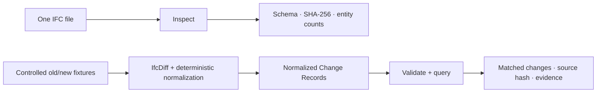

# BIMChange-Agent

**Auditable IFC revision intelligence, built from structured evidence.**

BIMChange-Agent is an offline-first research prototype and developer toolkit for inspecting IFC models, querying normalized BIM Change Records, and reproducing evidence-grounded agent evaluation.

BIMChange-Agent 是一个离线优先的研究原型与开发工具包，用于检查 IFC 模型、查询规范化 BIM 变更记录，并复现基于结构化证据的智能体评测。

[](https://github.com/delongwangshu49-hub/bimchange-agent/releases/tag/v0.1.0)


> [!IMPORTANT]
> v0.1.0 is source-run software, not an end-user BIM product. It does **not** yet provide a supported one-command path from arbitrary `old.ifc + new.ifc` files to normalized Change Records. The complete Gate 4 evaluation is public, but it is one controlled synthetic fixture—not a universal BIM benchmark.

## See it in 30 seconds / 30 秒了解项目



The first two lanes are directly usable offline. The third demonstrates the full pipeline on repository-controlled fixtures; arbitrary real-project IFC pairs are not yet a supported input.

| Run today | Input | Output |
|---|---|---|
| **Inspect IFC** | one `.ifc` path | deterministic JSON with schema, hash, entity total, and selected type counts |
| **Query changes** | JSON filters + schema-valid Change Records | validated matches with stable IDs, old/new values, source hash, and evidence selector |
| **Verify end to end** | included sample and query | a PASS record proving the quickstart used zero model calls |
| **Reproduce Gate 4** | frozen runs, scores, audit artifacts | independently verified summary, report, and research charts |

## Quickstart / 快速开始

Validated release environment: 64-bit Python 3.13 on Windows. These commands are offline and make no model/API calls.

```powershell
git clone https://github.com/delongwangshu49-hub/bimchange-agent.git
cd bimchange-agent
python -m venv .venv
.\.venv\Scripts\python.exe -m pip install -r requirements.txt

# 1. Inspect the included IFC model.
.\.venv\Scripts\python.exe scripts\check_ifc.py

# 2. Query added beams from the included Change Records.
.\.venv\Scripts\python.exe scripts\query_change_records.py examples\query-added-beams.json

# 3. Test both paths end to end.
.\.venv\Scripts\python.exe scripts\test_quickstart.py
```

The final command should report:

```json
{
  "status": "PASS",
  "ifc_schema": "IFC4",
  "ifc_entity_count": 407,
  "query_result_count": 1,
  "query_change_id": "gate2-added-001",
  "model_calls_made": 0
}
```

For custom paths, expected outputs, controlled fixture generation, Gate 4 verification, and safe dry-run behavior, use the [bilingual Quickstart and usage guide](docs/quickstart.md).

## Inputs and outputs / 输入与输出

Inspect any IFC that IfcOpenShell can open:

```powershell
.\.venv\Scripts\python.exe scripts\check_ifc.py C:\path\to\model.ifc
```

Query an already normalized Change Record artifact with a schema-valid request:

```json
{
  "schema_version": "0.1.0",
  "filters": {
    "change_types": ["added"],
    "entity_types": ["IfcBeam"]
  }
}
```

```powershell
.\.venv\Scripts\python.exe scripts\query_change_records.py request.json `
  --change-records C:\path\to\change-records.json `
  --output response.json
```

The response is validated against [`change-query-response.schema.json`](schemas/change-query-response.schema.json) and keeps the complete matching Change Records:

```json
{
  "schema_version": "0.1.0",
  "source": {
    "path": "data/ground_truth/gate2-change-records.json",
    "sha256": "..."
  },
  "filters": {
    "change_types": ["added"],
    "entity_types": ["IfcBeam"]
  },
  "result_count": 1,
  "results": [
    {
      "change_id": "gate2-added-001",
      "change_type": "added",
      "entity_type": "IfcBeam",
      "global_id": "1yBs77x9XA79IerK62qUGO",
      "evidence": {
        "detector": "IfcDiff 0.8.5",
        "result_file": "evals/results/gate2-ifcdiff.json",
        "selector": "added"
      }
    }
  ]
}
```

This query path consumes **already normalized** Change Records. It does not turn arbitrary raw IfcDiff output into the project schema.

## Capability boundary / 能力边界

| Layer | Status | What that means |
|---|---|---|
| IFC inspection | **usable now** | deterministic, offline, accepts a user-supplied IFC path |
| Change Record validation and query | **usable now** | deterministic, offline, accepts user-supplied schema-valid artifacts |
| Controlled fixture diff pipeline | **reproducible** | regenerates known revisions and normalized records for repository fixtures |
| Gate 4 evaluation package | **published and reproducible** | 360 frozen executions, scores, blind audit, independent validation, report, and chart matrix |
| Live AI workflows | **experimental** | dry-run by default; live use requires an explicitly configured provider key, `--live`, and cost authorization |
| Arbitrary IFC pair conversion | **not productized** | no supported general `old.ifc + new.ifc → Change Records` command |
| Packaging, GUI, Revit/authoring integration | **not available** | no `pyproject.toml`, wheel, installer, desktop UI, plug-in, or hosted API |

直接可用的是 IFC 检查和已规范化 Change Records 查询；评测与受控样例可离线复现；任意 IFC 文件对转换、安装式 CLI、GUI 与 Revit 集成仍属于后续产品化范围。

## Gate 4 research snapshot / Gate 4 科研结果


Across 120 scheduled executions per workflow, Proposed recorded 96.67% semantic exact match and 97.90% Change F1; Tool-Using Agent recorded 84.17% and 91.85%; Direct LLM recorded 54.17% and 63.16%. Deterministic evidence support reached 100% for Tool-Using Agent and Proposed.


The 40-question fixture covers six frozen categories. Category cuts are descriptive views of the same evaluation, not separate experiments. Human review remains distinct from deterministic evidence validation: one reviewer audited 135 sampled executions and 505 atomic claims, with 501 supported, one unsupported, and three indeterminate claims.

These results are bounded by one controlled synthetic IFC4 fixture, three repetitions, one model provider, frozen change types, and a single-reviewer audit. Read the [full bilingual results report](docs/gate4-held-out-results.md) for definitions, exact tables, Bootstrap intervals, operational accounting, and all limitations.

## Reproduce the evidence / 复现证据

Verify the published evaluation without generating model output:

```powershell
.\.venv\Scripts\python.exe scripts\verify_gate4_foundation.py
.\.venv\Scripts\python.exe scripts\verify_gate4_scores.py
.\.venv\Scripts\python.exe scripts\verify_gate4_offline_summary.py
.\.venv\Scripts\python.exe scripts\generate_gate4_results_document.py --check
```

Rebuild and verify the research chart matrix from the frozen machine-readable summary:

```powershell
.\.venv\Scripts\python.exe -m pip install -r requirements-visualization.txt
.\.venv\Scripts\python.exe scripts\generate_gate4_visualizations.py --write
.\.venv\Scripts\python.exe scripts\generate_gate4_visualizations.py --check
```

- [Visualization gallery and source map](docs/gate4-visualizations.md)
- [Machine-readable chart manifest](docs/assets/gate4/chart-manifest.json)
- [Machine-readable Gate 4 summary](evals/results/held_out/gate4-controlled-heldout-v0.1.0/gate4-offline-summary.json)
- [Independent validation](evals/results/held_out/gate4-controlled-heldout-v0.1.0/gate4-independent-validation.json)
- [Post-run audit](evals/audits/held_out/gate4-post-run-audit.json)
- [Release v0.1.0](https://github.com/delongwangshu49-hub/bimchange-agent/releases/tag/v0.1.0)

Gate 3 and Gate 4 workflow runners default to dry-run/offline behavior. Do not add `--live` unless a model call, credential, and cost are explicitly intended.

## Repository map / 仓库导航

```text
examples/                 runnable query inputs
src/bimchange_agent/      query, evidence, fixture, and workflow logic
schemas/                  versioned JSON contracts
scripts/                  inspection, generation, scoring, verification, and tests
data/                     attributed IFC source, fixtures, and Change Records
evals/                    frozen development and Gate 4 artifacts
docs/                     methods, boundaries, results, release notes, and visualizations
```

## Productization path / 产品化路线

1. **General diff core** — validate a supported `old.ifc + new.ifc → normalized Change Records` pipeline across explicit change types and failure modes.
2. **Installable CLI** — add `pyproject.toml` and coherent `bimchange inspect`, `bimchange diff`, and `bimchange query` commands.
3. **Compatibility envelope** — add cross-platform CI, real-project fixtures, exporter/schema coverage, performance budgets, and documented limits.
4. **Optional experience layers** — only then evaluate model-assisted explanations, GUI/Revit integration, and professional review workflows.

## License, attribution, and safety

Original code and documentation are MIT licensed. The initial IFC sample comes from buildingSMART's `Sample-Test-Files` repository under CC BY 4.0; provenance, retrieval date, and checksum are recorded in [`data/README.md`](data/README.md).

BIMChange-Agent does not replace professional BIM coordination, engineering review, structural-safety assessment, or formal regulatory-compliance checking.

本项目不能替代专业 BIM 协调、工程审查、结构安全评估或正式法规合规检查。
