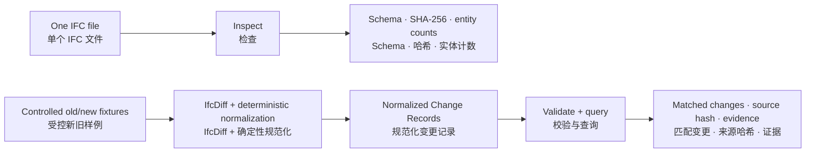

# BIMChange-Agent

**Auditable IFC revision intelligence, built from structured evidence.**

**以结构化证据为基础、可审计的 IFC 版本变更智能。**

BIMChange-Agent is an offline-first research prototype and developer toolkit for inspecting IFC models, querying normalized BIM Change Records, and reproducing evidence-grounded agent evaluation.

BIMChange-Agent 是一个离线优先的研究原型与开发工具包，用于检查 IFC 模型、查询规范化 BIM 变更记录，并复现基于结构化证据的智能体评测。

[](https://github.com/delongwangshu49-hub/bimchange-agent/releases/tag/v0.1.0)


> [!IMPORTANT]
> v0.1.0 is source-run software, not an end-user BIM product. It does **not** yet provide a supported one-command path from arbitrary `old.ifc + new.ifc` files to normalized Change Records. The complete Gate 4 evaluation is public, but it is one controlled synthetic fixture—not a universal BIM benchmark.
>
> v0.1.0 是从源码运行的研究软件，并非面向最终用户的 BIM 产品。它尚未提供将任意 `old.ifc + new.ifc` 一键转换为规范化 Change Records 的受支持路径；已公开的 Gate 4 评测仅基于一个受控合成样例，不是通用 BIM 基准。

## See it in 30 seconds / 30 秒了解项目



The first two lanes are directly usable offline. The third demonstrates the full pipeline on repository-controlled fixtures; arbitrary real-project IFC pairs are not yet a supported input.

前两条路径可以直接离线使用；第三条路径用于在仓库受控样例上演示完整流程。任意真实项目的 IFC 文件对目前仍不是受支持输入。

| Run today / 现在可运行 | Input / 输入 | Output / 输出 |
|---|---|---|
| **Inspect IFC / 检查 IFC** | one `.ifc` path / 单个 `.ifc` 路径 | deterministic JSON with schema, hash, entity total, and selected type counts / 包含 Schema、哈希、实体总数与分类计数的确定性 JSON |
| **Query changes / 查询变更** | JSON filters + schema-valid Change Records / JSON 筛选条件与符合 Schema 的变更记录 | validated matches with stable IDs, old/new values, source hash, and evidence selector / 带稳定 ID、新旧值、来源哈希和证据选择器的校验后结果 |
| **Verify end to end / 端到端验证** | included sample and query / 仓库自带样例与查询 | a PASS record proving the quickstart used zero model calls / 证明快速开始未调用模型的 PASS 记录 |
| **Reproduce Gate 4 / 复现 Gate 4** | frozen runs, scores, audit artifacts / 冻结运行、评分与审计产物 | independently verified summary, report, and research charts / 经独立验证的汇总、报告与科研图表 |

## Quickstart / 快速开始

Validated release environment: 64-bit Python 3.13 on Windows. These commands are offline and make no model/API calls.

已验证的发布环境为 Windows 64 位 Python 3.13；以下命令完全离线，不会调用模型或 API。

```powershell
git clone https://github.com/delongwangshu49-hub/bimchange-agent.git
cd bimchange-agent
python -m venv .venv
.\.venv\Scripts\python.exe -m pip install -r requirements.txt

# 1. Inspect the included IFC model. / 检查仓库自带 IFC 模型。
.\.venv\Scripts\python.exe scripts\check_ifc.py

# 2. Query added beams. / 从自带 Change Records 查询新增梁。
.\.venv\Scripts\python.exe scripts\query_change_records.py examples\query-added-beams.json

# 3. Test both paths end to end. / 端到端测试两条路径。
.\.venv\Scripts\python.exe scripts\test_quickstart.py
```

The final command should report:

最后一条命令应返回以下结果：

```json
{
  "status": "PASS",
  "ifc_schema": "IFC4",
  "ifc_entity_count": 407,
  "query_result_count": 1,
  "query_change_id": "gate2-added-001",
  "model_calls_made": 0
}
```

For custom paths, expected outputs, controlled fixture generation, Gate 4 verification, and safe dry-run behavior, use the [bilingual Quickstart and usage guide](docs/quickstart.md).

自定义路径、预期输出、受控样例生成、Gate 4 验证和安全 dry-run 行为详见[双语快速开始与使用指南](docs/quickstart.md)。

## Inputs and outputs / 输入与输出

Inspect any IFC that IfcOpenShell can open:

检查任意可由 IfcOpenShell 打开的 IFC 文件：

```powershell
.\.venv\Scripts\python.exe scripts\check_ifc.py C:\path\to\model.ifc
```

Query an already normalized Change Record artifact with a schema-valid request:

使用符合 Schema 的请求查询已经规范化的 Change Record 产物：

```json
{
  "schema_version": "0.1.0",
  "filters": {
    "change_types": ["added"],
    "entity_types": ["IfcBeam"]
  }
}
```

```powershell
.\.venv\Scripts\python.exe scripts\query_change_records.py request.json `
  --change-records C:\path\to\change-records.json `
  --output response.json
```

The response is validated against [`change-query-response.schema.json`](schemas/change-query-response.schema.json) and keeps the complete matching Change Records:

响应会依据 [`change-query-response.schema.json`](schemas/change-query-response.schema.json) 校验，并保留完整的匹配 Change Records：

```json
{
  "schema_version": "0.1.0",
  "source": {
    "path": "data/ground_truth/gate2-change-records.json",
    "sha256": "..."
  },
  "filters": {
    "change_types": ["added"],
    "entity_types": ["IfcBeam"]
  },
  "result_count": 1,
  "results": [
    {
      "change_id": "gate2-added-001",
      "change_type": "added",
      "entity_type": "IfcBeam",
      "global_id": "1yBs77x9XA79IerK62qUGO",
      "evidence": {
        "detector": "IfcDiff 0.8.5",
        "result_file": "evals/results/gate2-ifcdiff.json",
        "selector": "added"
      }
    }
  ]
}
```

This query path consumes **already normalized** Change Records. It does not turn arbitrary raw IfcDiff output into the project schema.

该查询路径只接收**已经规范化**的 Change Records，不会把任意原始 IfcDiff 输出自动转换为本项目 Schema。

## Capability boundary / 能力边界

| Layer / 层级 | Status / 状态 | What that means / 含义 |
|---|---|---|
| IFC inspection / IFC 检查 | **usable now / 当前可用** | deterministic and offline; accepts a user-supplied IFC path / 确定性离线运行，接受用户 IFC 路径 |
| Change Record validation and query / 变更记录校验与查询 | **usable now / 当前可用** | accepts user-supplied schema-valid artifacts / 接受用户提供且符合 Schema 的产物 |
| Controlled fixture diff pipeline / 受控样例差分流程 | **reproducible / 可复现** | regenerates known revisions and normalized records for repository fixtures / 可为仓库样例重建已知修订与规范化记录 |
| Gate 4 evaluation package / Gate 4 评测包 | **published and reproducible / 已发布且可复现** | 360 frozen executions, scores, blind audit, independent validation, report, and chart matrix / 包含 360 次冻结执行、评分、盲审、独立验证、报告与图表矩阵 |
| Live AI workflows / 实时 AI 工作流 | **experimental / 实验性** | dry-run by default; live use requires a provider key, `--live`, and cost authorization / 默认 dry-run；实时运行需要供应商密钥、`--live` 与费用授权 |
| Arbitrary IFC pair conversion / 任意 IFC 文件对转换 | **not productized / 尚未产品化** | no supported general `old.ifc + new.ifc → Change Records` command / 尚无受支持的通用转换命令 |
| Packaging, GUI, Revit integration / 打包、GUI、Revit 集成 | **not available / 尚不可用** | no installable package, desktop UI, plug-in, or hosted API / 尚无可安装包、桌面界面、插件或托管 API |

直接可用的是 IFC 检查和已规范化 Change Records 查询；评测与受控样例可离线复现；任意 IFC 文件对转换、安装式 CLI、GUI 与 Revit 集成仍属于后续产品化范围。

## Gate 4 research snapshot / Gate 4 科研结果


Across 120 scheduled executions per workflow, Proposed recorded 96.67% semantic exact match and 97.90% Change F1; Tool-Using Agent recorded 84.17% and 91.85%; Direct LLM recorded 54.17% and 63.16%. Deterministic evidence support reached 100% for Tool-Using Agent and Proposed.

每种工作流各执行 120 次：Proposed 的语义精确匹配率为 96.67%、Change F1 为 97.90%；Tool-Using Agent 分别为 84.17% 和 91.85%；Direct LLM 分别为 54.17% 和 63.16%。Tool-Using Agent 与 Proposed 的确定性证据支持率均为 100%。


The 40-question fixture covers six frozen categories. Category cuts are descriptive views of the same evaluation, not separate experiments. Human review remains distinct from deterministic evidence validation: one reviewer audited 135 sampled executions and 505 atomic claims, with 501 supported, one unsupported, and three indeterminate claims.

该 40 题样例覆盖六个冻结类别；分类结果只是同一评测的描述性切分，并非独立实验。人工审核与确定性证据校验保持分离：一名审核者检查了 135 次抽样执行和 505 条原子声明，其中 501 条获支持、1 条不获支持、3 条无法确定。

These results are bounded by one controlled synthetic IFC4 fixture, three repetitions, one model provider, frozen change types, and a single-reviewer audit. Read the [full bilingual results report](docs/gate4-held-out-results.md) for definitions, exact tables, Bootstrap intervals, operational accounting, and all limitations.

这些结果仅适用于一个受控合成 IFC4 样例、三次重复、单一模型供应商、冻结变化类型和单审核者审计。指标定义、精确表格、Bootstrap 区间、运行账目及全部限制详见[完整双语结果报告](docs/gate4-held-out-results.md)。

## Reproduce the evidence / 复现证据

Verify the published evaluation without generating model output:

在不生成任何模型输出的情况下验证已发布评测：

```powershell
.\.venv\Scripts\python.exe scripts\verify_gate4_foundation.py
.\.venv\Scripts\python.exe scripts\verify_gate4_scores.py
.\.venv\Scripts\python.exe scripts\verify_gate4_offline_summary.py
.\.venv\Scripts\python.exe scripts\generate_gate4_results_document.py --check
```

Rebuild and verify the research chart matrix from the frozen machine-readable summary:

从冻结的机器可读汇总重建并验证科研图表矩阵：

```powershell
.\.venv\Scripts\python.exe -m pip install -r requirements-visualization.txt
.\.venv\Scripts\python.exe scripts\generate_gate4_visualizations.py --write
.\.venv\Scripts\python.exe scripts\generate_gate4_visualizations.py --check
```

- [Visualization gallery and source map](docs/gate4-visualizations.md)
- [Machine-readable chart manifest](docs/assets/gate4/chart-manifest.json)
- [Machine-readable Gate 4 summary](evals/results/held_out/gate4-controlled-heldout-v0.1.0/gate4-offline-summary.json)
- [Independent validation](evals/results/held_out/gate4-controlled-heldout-v0.1.0/gate4-independent-validation.json)
- [Post-run audit](evals/audits/held_out/gate4-post-run-audit.json)
- [Release v0.1.0](https://github.com/delongwangshu49-hub/bimchange-agent/releases/tag/v0.1.0)

Gate 3 and Gate 4 workflow runners default to dry-run/offline behavior. Do not add `--live` unless a model call, credential, and cost are explicitly intended.

Gate 3 与 Gate 4 工作流默认执行 dry-run/离线路径；只有在明确计划调用模型、使用凭据并接受费用时才应添加 `--live`。

## Repository map / 仓库导航

```text
examples/                 runnable query inputs
src/bimchange_agent/      query, evidence, fixture, and workflow logic
schemas/                  versioned JSON contracts
scripts/                  inspection, generation, scoring, verification, and tests
data/                     attributed IFC source, fixtures, and Change Records
evals/                    frozen development and Gate 4 artifacts
docs/                     methods, boundaries, results, release notes, and visualizations
```

## Productization path / 产品化路线

1. **General diff core** — validate a supported `old.ifc + new.ifc → normalized Change Records` pipeline across explicit change types and failure modes.
2. **Installable CLI** — add `pyproject.toml` and coherent `bimchange inspect`, `bimchange diff`, and `bimchange query` commands.
3. **Compatibility envelope** — add cross-platform CI, real-project fixtures, exporter/schema coverage, performance budgets, and documented limits.
4. **Optional experience layers** — only then evaluate model-assisted explanations, GUI/Revit integration, and professional review workflows.

产品化顺序是：先完成通用差分核心，再提供可安装 CLI，随后建立跨平台兼容性与性能边界；模型解释、GUI/Revit 集成和专业审核工作流应最后考虑。

## License, attribution, and safety

Original code and documentation are MIT licensed. The initial IFC sample comes from buildingSMART's `Sample-Test-Files` repository under CC BY 4.0; provenance, retrieval date, and checksum are recorded in [`data/README.md`](data/README.md).

BIMChange-Agent does not replace professional BIM coordination, engineering review, structural-safety assessment, or formal regulatory-compliance checking.

本项目不能替代专业 BIM 协调、工程审查、结构安全评估或正式法规合规检查。
