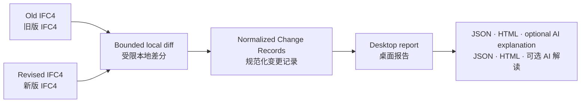

# BIMChange-Agent

**Auditable IFC revision intelligence, built from structured evidence.**

**以结构化证据为基础、可审计的 IFC 版本变更智能。**

BIMChange-Agent is an offline-first IFC revision research project now entering an early Windows desktop engineering preview. It combines bounded deterministic IFC4 comparison, normalized Change Records, optional AI explanation, and a fully reproducible research evaluation track.

BIMChange-Agent 是一个离线优先的 IFC 版本变更研究项目，现已进入 Windows 桌面端早期工程预览阶段：提供受限的确定性 IFC4 比较、规范化 Change Records、可选 AI 解读，并保留完整可复现的科研评测路线。

[](https://github.com/delongwangshu49-hub/bimchange-agent/releases/tag/v0.2.0-preview.1)
[](https://github.com/delongwangshu49-hub/bimchange-agent/releases/tag/v0.1.0)


> [!IMPORTANT]
> v0.2.0 Preview 1 is an **early engineering preview**, not the final product experience and not a claim of general IFC compatibility. It accepts only a deliberately bounded IFC4 subset and is intended to validate the desktop workflow with representative files. v0.1.0 remains the frozen research release and Gate 4 evidence baseline.
>
> v0.2.0 Preview 1 是**早期工程预览版**，不代表最终产品效果，也不宣称通用 IFC 兼容性。它只接受经过主动收窄的 IFC4 输入范围，用于通过代表性文件验证桌面工作流。v0.1.0 继续作为冻结的研究发布版与 Gate 4 证据基线。

## Download the Windows preview / 下载 Windows 预览版

Download `BIMChange-Agent-0.2.0-preview.1-win-x64.zip` from the [v0.2.0 Preview 1 pre-release](https://github.com/delongwangshu49-hub/bimchange-agent/releases/tag/v0.2.0-preview.1), verify the accompanying SHA-256, extract the entire ZIP, and double-click `BIMChange-Agent.exe`. Python is not required.

从 [v0.2.0 Preview 1 预发布页面](https://github.com/delongwangshu49-hub/bimchange-agent/releases/tag/v0.2.0-preview.1)下载 `BIMChange-Agent-0.2.0-preview.1-win-x64.zip`，核对随附 SHA-256，完整解压后双击 `BIMChange-Agent.exe`，无需安装 Python。

1. Select or drag an old IFC into the left panel. / 在左栏选择或拖入旧版 IFC。
2. Select or drag the revised IFC into the right panel. / 在右栏选择或拖入新版 IFC。
3. Keep AI off for a fully local deterministic report, then click **Start analysis**. / AI 保持关闭即可完全本地分析，然后点击“开始分析”。
4. Review the report and export JSON or self-contained HTML. / 查看报告并按需导出 JSON 或独立 HTML。

The preview supports exact IFC4, at most 50 MiB and 5,000 `IfcElement` objects per file, and requires at least 50% shared element GlobalIds on the smaller side. Supported normalized changes are addition, deletion, and property-value modification. The executable is not code-signed, so Windows SmartScreen may show an unknown-publisher warning; download only from this repository and verify the checksum.

预览版仅支持精确 IFC4、单文件不超过 50 MiB、每版最多 5,000 个 `IfcElement`，且较小一侧至少 50% 的构件 GlobalId 重合；当前规范化新增、删除与属性值修改。程序尚未代码签名，Windows SmartScreen 可能提示未知发布者，请只从本仓库下载并核对校验值。

Welcome to try it and [open an issue](https://github.com/delongwangshu49-hub/bimchange-agent/issues/new/choose). Please include the preview version, Windows version, IFC schema, file sizes, and reproducible steps—but never upload confidential IFC files, API keys, or unredacted reports to a public issue.

欢迎试用并[提交反馈](https://github.com/delongwangshu49-hub/bimchange-agent/issues/new/choose)。请说明预览版版本、Windows 版本、IFC Schema、文件大小和复现步骤，但不要向公开 Issue 上传保密 IFC、API Key 或未经脱敏的报告。

## See it in 30 seconds / 30 秒了解项目



The deterministic path stays local and is authoritative. AI is off by default and is only an optional explanation layer. Arbitrary real-project IFC pairs remain outside the support claim until the compatibility envelope is measured.

确定性路径在本地运行并作为权威结果；AI 默认关闭，只是可选解释层。在真实样本兼容范围完成测量前，本项目仍不宣称支持任意真实工程 IFC 文件对。

| Run today / 现在可运行 | Input / 输入 | Output / 输出 |
|---|---|---|
| **Inspect IFC / 检查 IFC** | one `.ifc` path / 单个 `.ifc` 路径 | deterministic JSON with schema, hash, entity total, and selected type counts / 包含 Schema、哈希、实体总数与分类计数的确定性 JSON |
| **Windows desktop preview / Windows 桌面预览** | bounded old/new IFC4 pair / 受限新旧 IFC4 文件对 | in-app report plus JSON/HTML export / 应用内报告及 JSON/HTML 导出 |
| **Query changes / 查询变更** | JSON filters + schema-valid Change Records / JSON 筛选条件与符合 Schema 的变更记录 | validated matches with stable IDs, old/new values, source hash, and evidence selector / 带稳定 ID、新旧值、来源哈希和证据选择器的校验后结果 |
| **Verify end to end / 端到端验证** | included sample and query / 仓库自带样例与查询 | a PASS record proving the quickstart used zero model calls / 证明快速开始未调用模型的 PASS 记录 |
| **Reproduce Gate 4 / 复现 Gate 4** | frozen runs, scores, audit artifacts / 冻结运行、评分与审计产物 | independently verified summary, report, and research charts / 经独立验证的汇总、报告与科研图表 |

## Quickstart / 快速开始

Validated release environment: 64-bit Python 3.13 on Windows. These commands are offline and make no model/API calls.

已验证的发布环境为 Windows 64 位 Python 3.13；以下命令完全离线，不会调用模型或 API。

```powershell
git clone https://github.com/delongwangshu49-hub/bimchange-agent.git
cd bimchange-agent
python -m venv .venv
.\.venv\Scripts\python.exe -m pip install -r requirements.txt

# 1. Inspect the included IFC model. / 检查仓库自带 IFC 模型。
.\.venv\Scripts\python.exe scripts\check_ifc.py

# 2. Query added beams. / 从自带 Change Records 查询新增梁。
.\.venv\Scripts\python.exe scripts\query_change_records.py examples\query-added-beams.json

# 3. Test both paths end to end. / 端到端测试两条路径。
.\.venv\Scripts\python.exe scripts\test_quickstart.py
```

The final command should report:

最后一条命令应返回以下结果：

```json
{
  "status": "PASS",
  "ifc_schema": "IFC4",
  "ifc_entity_count": 407,
  "query_result_count": 1,
  "query_change_id": "gate2-added-001",
  "model_calls_made": 0
}
```

For custom paths, expected outputs, controlled fixture generation, Gate 4 verification, and safe dry-run behavior, use the [bilingual Quickstart and usage guide](docs/quickstart.md).

自定义路径、预期输出、受控样例生成、Gate 4 验证和安全 dry-run 行为详见[双语快速开始与使用指南](docs/quickstart.md)。

## Inputs and outputs / 输入与输出

Inspect any IFC that IfcOpenShell can open:

检查任意可由 IfcOpenShell 打开的 IFC 文件：

```powershell
.\.venv\Scripts\python.exe scripts\check_ifc.py C:\path\to\model.ifc
```

Query an already normalized Change Record artifact with a schema-valid request:

使用符合 Schema 的请求查询已经规范化的 Change Record 产物：

```json
{
  "schema_version": "0.1.0",
  "filters": {
    "change_types": ["added"],
    "entity_types": ["IfcBeam"]
  }
}
```

```powershell
.\.venv\Scripts\python.exe scripts\query_change_records.py request.json `
  --change-records C:\path\to\change-records.json `
  --output response.json
```

The response is validated against [`change-query-response.schema.json`](schemas/change-query-response.schema.json) and keeps the complete matching Change Records:

响应会依据 [`change-query-response.schema.json`](schemas/change-query-response.schema.json) 校验，并保留完整的匹配 Change Records：

```json
{
  "schema_version": "0.1.0",
  "source": {
    "path": "data/ground_truth/gate2-change-records.json",
    "sha256": "..."
  },
  "filters": {
    "change_types": ["added"],
    "entity_types": ["IfcBeam"]
  },
  "result_count": 1,
  "results": [
    {
      "change_id": "gate2-added-001",
      "change_type": "added",
      "entity_type": "IfcBeam",
      "global_id": "1yBs77x9XA79IerK62qUGO",
      "evidence": {
        "detector": "IfcDiff 0.8.5",
        "result_file": "evals/results/gate2-ifcdiff.json",
        "selector": "added"
      }
    }
  ]
}
```

This query path consumes **already normalized** Change Records. It does not turn arbitrary raw IfcDiff output into the project schema.

该查询路径只接收**已经规范化**的 Change Records，不会把任意原始 IfcDiff 输出自动转换为本项目 Schema。

## Capability boundary / 能力边界

| Layer / 层级 | Status / 状态 | What that means / 含义 |
|---|---|---|
| IFC inspection / IFC 检查 | **usable now / 当前可用** | deterministic and offline; accepts a user-supplied IFC path / 确定性离线运行，接受用户 IFC 路径 |
| Change Record validation and query / 变更记录校验与查询 | **usable now / 当前可用** | accepts user-supplied schema-valid artifacts / 接受用户提供且符合 Schema 的产物 |
| Controlled fixture diff pipeline / 受控样例差分流程 | **reproducible / 可复现** | regenerates known revisions and normalized records for repository fixtures / 可为仓库样例重建已知修订与规范化记录 |
| Gate 4 evaluation package / Gate 4 评测包 | **published and reproducible / 已发布且可复现** | 360 frozen executions, scores, blind audit, independent validation, report, and chart matrix / 包含 360 次冻结执行、评分、盲审、独立验证、报告与图表矩阵 |
| Live AI workflows / 实时 AI 工作流 | **experimental / 实验性** | dry-run by default; live use requires a provider key, `--live`, and cost authorization / 默认 dry-run；实时运行需要供应商密钥、`--live` 与费用授权 |
| Bounded IFC4 pair conversion / 受限 IFC4 文件对转换 | **early preview / 早期预览** | supported only inside the explicit v0.2 guardrails / 仅在 v0.2 明确护栏内支持 |
| Windows packaging and GUI / Windows 打包与界面 | **early preview / 早期预览** | portable ZIP and desktop report flow; not code-signed / 便携 ZIP 与桌面报告流程，尚未代码签名 |
| Arbitrary IFC, 3D and Revit / 任意 IFC、三维与 Revit | **not supported / 尚不支持** | compatibility evidence and integrations remain future work / 兼容证据与集成仍属后续工作 |

当前可用的是受限 IFC4 桌面比较、IFC 检查、Change Records 查询和研究复现；任意 IFC、三维预览与 Revit 集成仍不在支持范围内。

## Gate 4 research snapshot / Gate 4 科研结果


Across 120 scheduled executions per workflow, Proposed recorded 96.67% semantic exact match and 97.90% Change F1; Tool-Using Agent recorded 84.17% and 91.85%; Direct LLM recorded 54.17% and 63.16%. Deterministic evidence support reached 100% for Tool-Using Agent and Proposed.

每种工作流各执行 120 次：Proposed 的语义精确匹配率为 96.67%、Change F1 为 97.90%；Tool-Using Agent 分别为 84.17% 和 91.85%；Direct LLM 分别为 54.17% 和 63.16%。Tool-Using Agent 与 Proposed 的确定性证据支持率均为 100%。


The 40-question fixture covers six frozen categories. Category cuts are descriptive views of the same evaluation, not separate experiments. Human review remains distinct from deterministic evidence validation: one reviewer audited 135 sampled executions and 505 atomic claims, with 501 supported, one unsupported, and three indeterminate claims.

该 40 题样例覆盖六个冻结类别；分类结果只是同一评测的描述性切分，并非独立实验。人工审核与确定性证据校验保持分离：一名审核者检查了 135 次抽样执行和 505 条原子声明，其中 501 条获支持、1 条不获支持、3 条无法确定。

These results are bounded by one controlled synthetic IFC4 fixture, three repetitions, one model provider, frozen change types, and a single-reviewer audit. Read the [full bilingual results report](docs/gate4-held-out-results.md) for definitions, exact tables, Bootstrap intervals, operational accounting, and all limitations.

这些结果仅适用于一个受控合成 IFC4 样例、三次重复、单一模型供应商、冻结变化类型和单审核者审计。指标定义、精确表格、Bootstrap 区间、运行账目及全部限制详见[完整双语结果报告](docs/gate4-held-out-results.md)。

## Reproduce the evidence / 复现证据

Verify the published evaluation without generating model output:

在不生成任何模型输出的情况下验证已发布评测：

```powershell
.\.venv\Scripts\python.exe scripts\verify_gate4_foundation.py
.\.venv\Scripts\python.exe scripts\verify_gate4_scores.py
.\.venv\Scripts\python.exe scripts\verify_gate4_offline_summary.py
.\.venv\Scripts\python.exe scripts\generate_gate4_results_document.py --check
```

Rebuild and verify the research chart matrix from the frozen machine-readable summary:

从冻结的机器可读汇总重建并验证科研图表矩阵：

```powershell
.\.venv\Scripts\python.exe -m pip install -r requirements-visualization.txt
.\.venv\Scripts\python.exe scripts\generate_gate4_visualizations.py --write
.\.venv\Scripts\python.exe scripts\generate_gate4_visualizations.py --check
```

- [Visualization gallery and source map](docs/gate4-visualizations.md)
- [Machine-readable chart manifest](docs/assets/gate4/chart-manifest.json)
- [Machine-readable Gate 4 summary](evals/results/held_out/gate4-controlled-heldout-v0.1.0/gate4-offline-summary.json)
- [Independent validation](evals/results/held_out/gate4-controlled-heldout-v0.1.0/gate4-independent-validation.json)
- [Post-run audit](evals/audits/held_out/gate4-post-run-audit.json)
- [Release v0.1.0](https://github.com/delongwangshu49-hub/bimchange-agent/releases/tag/v0.1.0)

Gate 3 and Gate 4 workflow runners default to dry-run/offline behavior. Do not add `--live` unless a model call, credential, and cost are explicitly intended.

Gate 3 与 Gate 4 工作流默认执行 dry-run/离线路径；只有在明确计划调用模型、使用凭据并接受费用时才应添加 `--live`。

## Repository map / 仓库导航

```text
examples/                 runnable query inputs
src/bimchange_agent/      desktop, diff, query, evidence, and workflow logic
schemas/                  versioned JSON contracts
scripts/                  inspection, generation, scoring, verification, and tests
tests/                    offline product-core, report, and desktop regression tests
packaging/                Windows start guide and third-party notices
data/                     attributed IFC source, fixtures, and Change Records
evals/                    frozen development and Gate 4 artifacts
docs/                     methods, boundaries, results, release notes, and visualizations
pyproject.toml            installable CLI/desktop package and pinned preview dependencies
constraints-preview.txt   exact dependency set used for the Windows preview build
```

## Productization path / 产品化路线

The v0.2.0 Preview 1 checkpoint adds a bounded IFC4 diff/normalization service, installable `inspect/diff/query` commands, a PySide6 desktop flow, JSON/HTML reports, and an optional DeepSeek explanation boundary. It is an engineering checkpoint—not a replacement for the frozen v0.1.0 research release or evidence package. See the [preview contract](docs/product-preview-v0.2.md), [privacy and security boundary](docs/privacy-and-security.md), [release notes](docs/releases/v0.2.0-preview.1.md), and [roadmap](docs/roadmap.md).

v0.2.0 Preview 1 定档包含受限 IFC4 差分/规范化、可安装 `inspect/diff/query`、PySide6 桌面流程、JSON/HTML 报告和可选 DeepSeek 解读边界。它是工程检查点，不替代冻结的 v0.1.0 科研发布与证据包。详见[预览契约](docs/product-preview-v0.2.md)、[隐私与安全边界](docs/privacy-and-security.md)、[版本说明](docs/releases/v0.2.0-preview.1.md)和[路线图](docs/roadmap.md)。

1. **Keep the bounded core trustworthy** — use a small number of authorized representative IFC4 files as smoke checks, classify clear failures, and keep the support claim narrow.
2. **Improve the review experience** — turn the existing upload-to-report path into a more legible, guided, and visually coherent desktop experience before broadening technical scope.
3. **Expand AI deliberately** — retain the deterministic Change Record as the source of fact, while adding provider adapters and user-selected configuration only after each provider has a documented privacy boundary and offline request/error tests.
4. **Build research-backed capability** — study evidence traceability, AI-explanation reliability, and review efficiency so feature decisions have measurable support.
5. **Explore spatial change context as a side track** — a later local viewer should show changed elements and a small spatial context, colour-code change types, and connect report rows to `GlobalId`; it is not a commitment to build a general-purpose BIM viewer.

后续主线是：用少量获授权 IFC4 小样本完成烟雾验证，保持支持边界收窄；随后优先提升上传、分析、报告、错误提示和导出的整体审阅体验；在确定性 Change Records 仍为事实源的前提下，逐家补齐可选 AI 服务商的适配、隐私边界和离线请求/错误测试。科研副线将围绕证据可追溯性、AI 解读可靠性和审阅效率展开。三维作为穿插探索，目标是把变化构件及其局部空间上下文以颜色和 `GlobalId` 高亮呈现，而不是承诺完整 BIM 浏览器。详见[路线图](docs/roadmap.md)、[科研与能力探索方向](docs/research-directions.md)和[后续三维预览选项](docs/three-dimensional-preview-options.md)。

## License, attribution, and safety

Original code and documentation are MIT licensed. The Windows package also contains third-party components under their own licenses, including LGPL components; see [`packaging/THIRD-PARTY-NOTICES.txt`](packaging/THIRD-PARTY-NOTICES.txt). The initial IFC sample comes from buildingSMART's `Sample-Test-Files` repository under CC BY 4.0; provenance, retrieval date, and checksum are recorded in [`data/README.md`](data/README.md).

BIMChange-Agent does not replace professional BIM coordination, engineering review, structural-safety assessment, or formal regulatory-compliance checking.

本项目不能替代专业 BIM 协调、工程审查、结构安全评估或正式法规合规检查。
