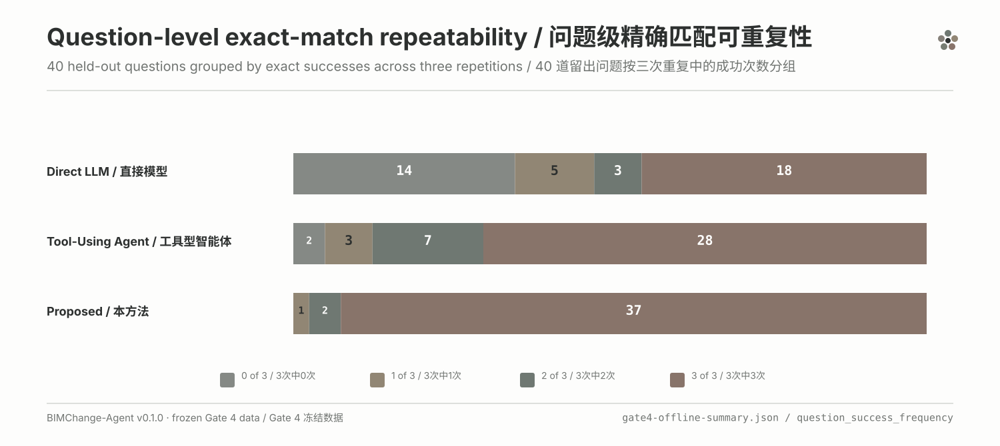
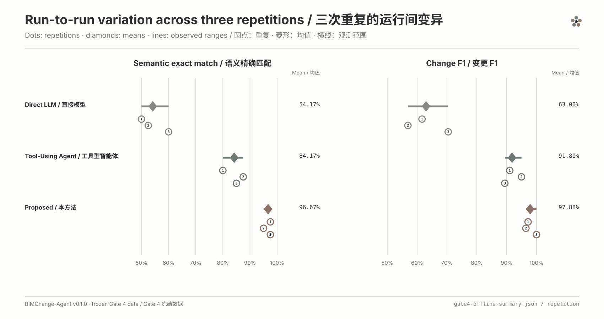
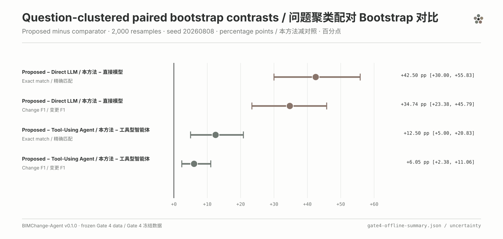
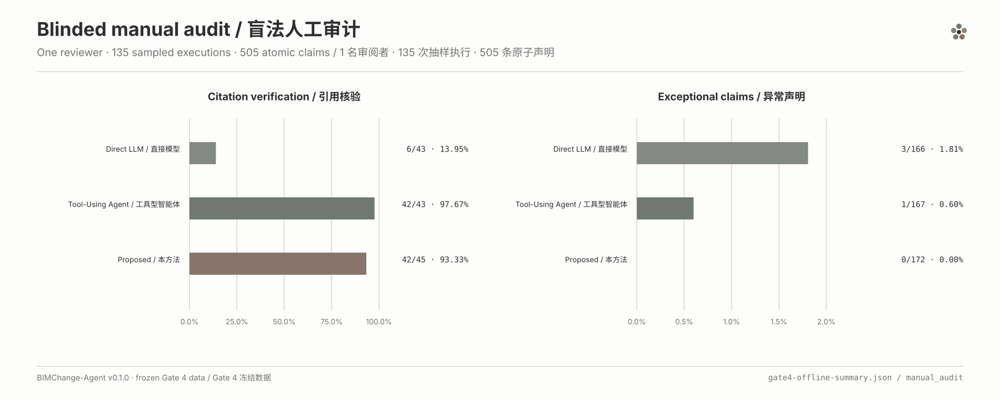

# Gate 4 visualization gallery

This gallery turns the frozen, machine-readable Gate 4 v0.1.0 results into a small audit-ready chart matrix. It does not rerun evaluation, rescore candidates, call a model, or change any frozen contract.

> Scope: 40 English questions × 3 workflows × 3 repetitions = 360 scheduled primary executions on one independently constructed controlled synthetic IFC4 fixture. These charts are not evidence of universal BIM performance.

## Source contract

The sole numeric source is [`gate4-offline-summary.json`](../evals/results/held_out/gate4-controlled-heldout-v0.1.0/gate4-offline-summary.json). Its Git-normalized SHA-256 is `bbcb09c7daf34b83de8e4dd36a7af3abe342bc4c41724b2a6fffa022fedb9694`, matching the frozen [`gate4-independent-validation.json`](../evals/results/held_out/gate4-controlled-heldout-v0.1.0/gate4-independent-validation.json) record. The independent validation status is `PASS_WITH_RECORDED_DATA_LIMITATIONS`.

[`chart-manifest.json`](assets/gate4/chart-manifest.json) records every chart's analytical question, source fields, form, dimensions, README placement, output paths, and SVG/PNG hashes. SVG is the canonical deterministic format. PNG is a convenience derivative rendered from the same scene graph.

| Chart | Frozen source fields | Form | README |
|---|---|---|---|
| Workflow performance | `overall_by_workflow.*.{semantic_exact_match_accuracy,change_f1,evidence_support_rate}` | grouped horizontal bars | yes |
| Category exact match | `per_category.*.*.semantic_exact_match_accuracy` | annotated heatmap | yes |
| Question repeatability | `question_success_frequency.*.frequency_distribution` | 100% stacked bars with counts | no |
| Repetition stability | `repetition.*.{per_repetition,across_repetition_summary}` | dots + observed ranges | no |
| Bootstrap contrasts | `uncertainty.pairs.*.{semantic_exact_match_accuracy,change_f1}` | paired-bootstrap forest plot | no |
| Manual audit | `manual_audit.by_workflow` | two-panel horizontal bars | no |

## Core workflow comparison


Across 120 scheduled executions per workflow, Proposed recorded 96.67% semantic exact match and 97.90% Change F1. Tool-Using Agent recorded 84.17% and 91.85%; Direct LLM recorded 54.17% and 63.16%. Deterministic evidence support is a machine check and must not be merged with the stricter human citation audit below.

## Category structure


The category view retains the frozen taxonomy and the original denominators. Categories are descriptive cuts of the same 360 executions, not independent experiments. The most pronounced contrast is the `property_change` category, where Direct LLM recorded 11.11% exact match, Tool-Using Agent 100.00%, and Proposed 94.44%.

## Question-level repeatability



For Proposed, 37 of 40 questions were exact in all three repetitions, two were exact twice, one was exact once, and none failed exact match in all three repetitions. The corresponding `3/3` counts are 28 for Tool-Using Agent and 18 for Direct LLM.

## Repetition stability



Only three repetition blocks exist, so this figure deliberately uses dots and observed ranges rather than a trend line. Diamonds show block means; they are not confidence estimates.

## Clustered bootstrap contrasts



The source stores contrasts as comparator minus Proposed. The chart reverses the sign to show Proposed minus comparator and records that transformation in the manifest. All three repetitions for a sampled question remain in the same cluster. The fixed-seed 2,000-resample percentile intervals describe uncertainty inside this fixture; they are not standalone significance tests and do not justify external generalization.

## Blinded manual audit



One reviewer audited 135 sampled executions and 505 atomic claims. Citation verification uses audited candidates as its denominator: `6/43`, `42/43`, and `42/45`. Claim exceptions use atomic claims: `3/166`, `1/167`, and `0/172`. The audit contains one safety-overreach label and cannot support inter-rater agreement.

## Reproduce and verify

From a repository checkout, install the isolated visualization dependency and regenerate both formats:

```powershell
.\.venv\Scripts\python.exe -m pip install -r requirements-visualization.txt
.\.venv\Scripts\python.exe scripts\generate_gate4_visualizations.py --write
```

Verify the frozen source hash, invariant counts, canonical SVG bytes, committed asset hashes, PNG dimensions, Bootstrap seed, resample count, and independent-validation status:

```powershell
.\.venv\Scripts\python.exe scripts\generate_gate4_visualizations.py --check
```

Expected result:

```json
{
  "status": "PASS",
  "chart_count": 6,
  "canonical_svg_regeneration": "byte-identical",
  "independent_validation_status": "PASS_WITH_RECORDED_DATA_LIMITATIONS",
  "model_calls_made": 0
}
```

The PNG renderer uses the pinned Pillow version and available local TrueType fonts. SVG is the byte-deterministic reference because raster font rendering can vary across operating systems.

## Recorded limitations

The chart matrix preserves the release limitations: one controlled synthetic fixture, three repetitions, one model provider, frozen change types, a single human reviewer, no deterministic free-text semantic score, no reconstructable per-execution latency, and incomplete per-call-kind token/cost attribution. See the [full bilingual Gate 4 report](gate4-held-out-results.md) for definitions, exact tables, operational accounting, and publication history.
